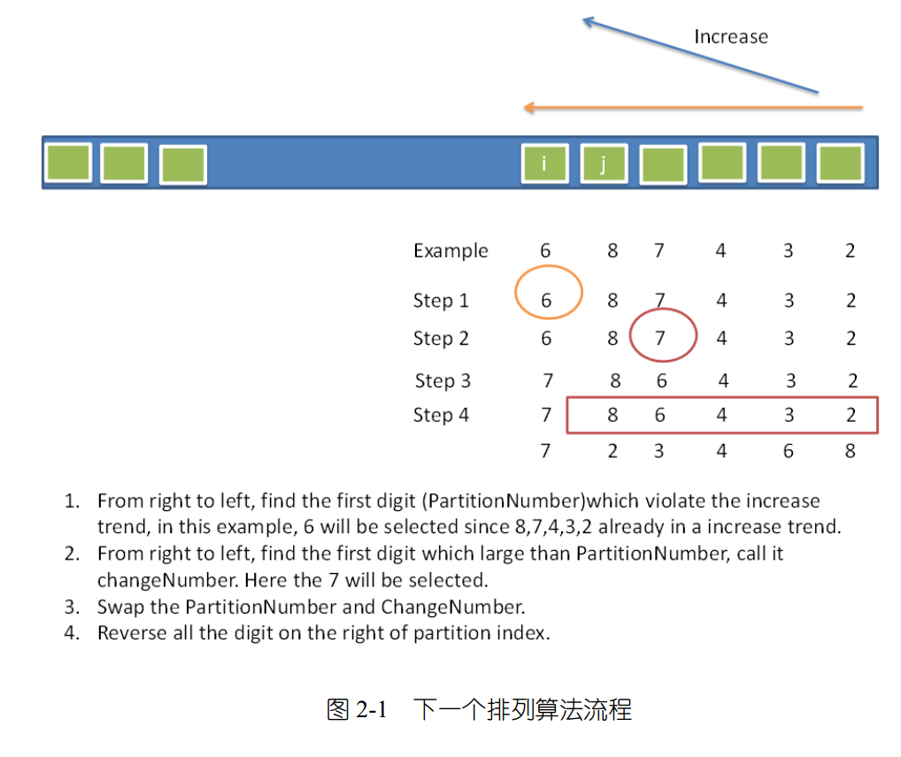

#### Q
Implement next permutation, which rearranges numbers into the lexicographically next greater permutation of numbers.
If such arrangement is not possible, it must rearrange it as the lowest possible order (ie, sorted in ascending order).
The replacement must be in-place, do not allocate extra memory.
Here are some examples. Inputs are in the left-hand column and its corresponding outputs are in the
right-hand column.
1,2,3 → 1,3,2
3,2,1 → 1,2,3
1,1,5 → 1,5,1
即下一个更大的排列。

#### A

大概思路时：

1. 从后面往前比较，直到遇到一个比当前值更小的值，
2. 然后从后面的元素中找一个比这个更小值大一些的值，
3. 交换这两个值，
4. 然后reverse（使得后面的序列变为升序）

