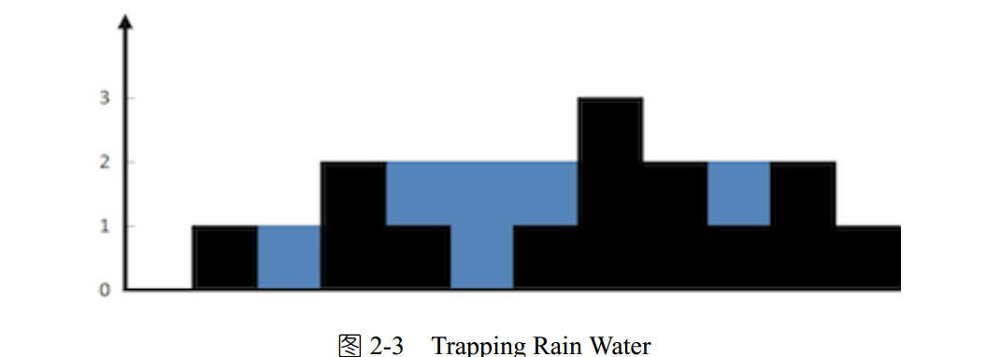

#### Q

能存多少水？  

Given n non-negative integers representing an elevation map where the width of each bar is 1, compute
how much water it is able to trap after raining.
For example, Given [0,1,0,2,1,0,1,3,2,1,2,1], return 6 



#### A

对于上图的柱子，我们需要得到每个柱子左边和右边的边界，具体做法是：  
从左往右扫描一遍，得到左边界（左边最大值）；再从右往左扫一遍（右边最大值），得到右边界，对于问题中的数组，得到的左右边界是：
[0 1 1 2 2 2 2 3 3 3 3]
[1 2 2 2 3 3 3 3 3 3 3 ]
然后取两个边界的最小值，即可以容纳的体积，最后得到的water=min(right,left)-height；。

```C++
#include <iostream>
#include <vector>


using namespace std;
int trap(const vector<int>& A) {
    const int n = A.size();
    int *max_left = new int[n]();
    int *max_right = new int[n]();
    for (int i = 1; i < n; i++) {
        int temp1=max_left[i] = max(max_left[i - 1], A[i - 1]);
        int temp2=max_right[n - 1 - i] = max(max_right[n - i], A[n - i]);
    }
    int sum = 0;
    for (int i = 0; i < n; i++) {
        int height = min(max_left[i], max_right[i]);
        if (height > A[i]) {
            sum += height - A[i];
        }
    }
    delete[] max_left;
    delete[] max_right;
    return sum;
}


int main()
{
    vector<int> A={0,1,0,2,1,0,1,3,2,1,2,1};
    cout<<trap(A)<<endl;


    return 0;
}
```
