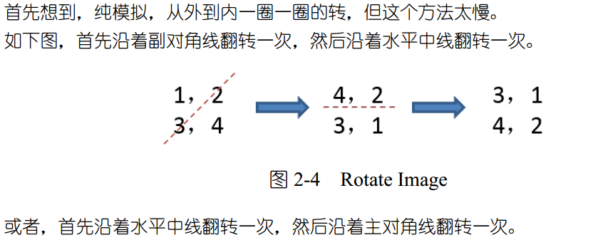

#### Q

You are given an n × n 2D matrix representing an image.
Rotate the image by 90 degrees (clockwise).
Follow up: Could you do this in-place? 

#### A
逆时针旋转90度，还不能多分配空间。




```C++
#include <iostream>
#include <vector>


using namespace std;
void rotate(vector<vector<int>>& matrix)
{
    const int n = matrix.size();//这里是获得row；
    //int size_col = vec[0].size();  //获取列数
    for (int i = 0; i < n; ++i) // 沿对角线翻转；
        for (int j = 0; j < n - i; ++j)
            swap(matrix[i][j], matrix[n - 1 - j][n - 1 - i]);//注意n比索引要大1；
    for (int i = 0; i < n/2; ++i) // 沿对角线翻转；
        for (int j = 0; j < n; ++j)
            swap(matrix[i][j], matrix[n-1-i][j]);
}

int main()
{
    vector<vector<int>> A={{1,2},{3,4}};
    int n = A.size();
    for (int i = 0; i < n; ++i){ // 沿对角线翻转；
        for (int j = 0; j < n; ++j)
            cout<<A[i][j]<<",";
        cout<<endl;
    }
    rotate(A);
    for (int i = 0; i < n; ++i){ // 沿对角线翻转；
        for (int j = 0; j < n; ++j)
            cout<<A[i][j]<<",";
        cout<<endl;
    }


    return 0;
}

```

