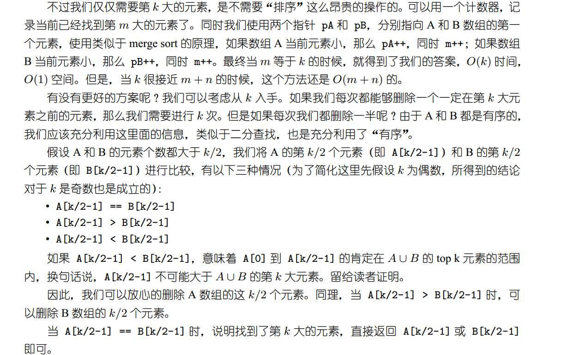

#### Q

There are two sorted arrays A and B of size m and n respectively. Find the median of the two sorted
arrays. The overall run time complexity should be O(log(m + n)) 

#### Analysis

求两个排序后数组所有元素的中位数。

1. 两个数组没有重合范围，直接把大数组的索引全部加上m（m为小数组的size），再取中位数；

2. 两个数组有重合范围，用二分法。本质上是求第k大的元素，如数组A有6个元素，B有7个元素，则中位数是第7大的数； 

   

   #### 计数器实现

   ```C++
   #include <iostream>
   #include <vector>
   
   using namespace std;
   
   int search(vector<int>& numsA,vector<int>& numsB){
       int size_A=numsA.size();
       int size_B=numsB.size();
       int k=(size_A+size_B)/2;//k 为中位数；其实这里不太准确。
       int i=0;
       int j=0;
       while(k>0){
           if(i<size_A&&j<size_B){//注意这里A和B数组的大小可能相差很大；
   
               if (numsA[i]<numsB[j]){
                   ++i;
               }
               else
                   ++j;
               --k;//比较过一次了；
   
               }
           else if (i>=size_A && j<size_B){
               ++j;--k;
               return numsB[j];
           }
           else {
               ++i;--k;
               return numsA[i];
   
           }
       }
   }
   int main()
   {
       vector<int> numsB={1,3,5,7,9,11};//example
       vector<int> numsA={12,14,16,18,20,22,24,33,35,67,70};//example
       cout<<search(numsA, numsB)<<endl;
   
   
       return 0;
   }
   
   ```

   #### 二分法

   ```C++
   
   ```

   