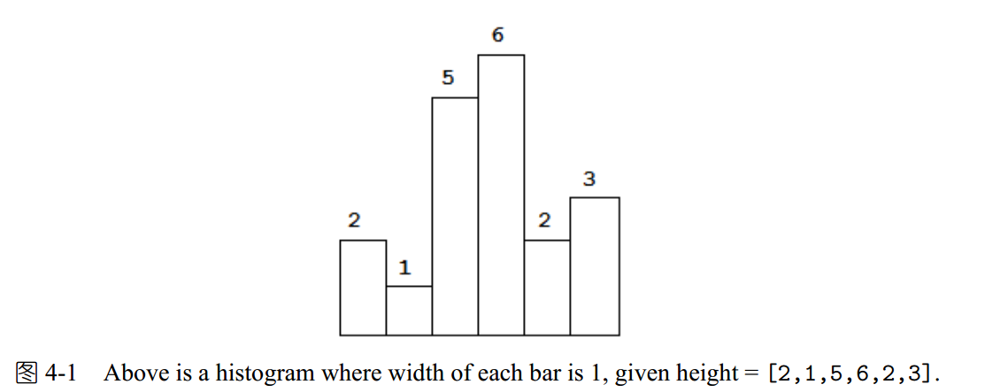
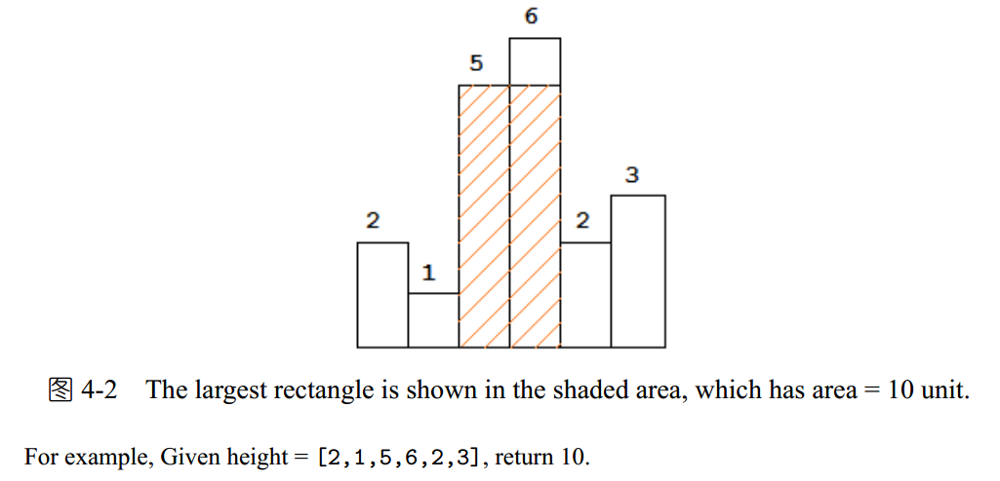

Given n non-negative integers representing the histogram’s bar height where the width of each bar is 1,
find the area of largest rectangle in the histogram 






代码太难了。

```C++

#include <iostream>
#include <stack>
#include <vector>
#include <algorithm>

using namespace std;

int largestRectangleArea(vector<int>& height) {
    stack<int> s;
    height.push_back(0);//加0相当于最后有一个为0的梯形；
    int result = 0;
    for (int i = 0; i < height.size(); ) {
        if (s.empty() || height[i] > height[s.top()])//如果遇到比当前最高还要高的值；
            s.push(i++);//记录递增的梯形位置；
        else {//当梯形下降时；
            int tmp = s.top();
            s.pop();
            result = max(result,
                height[tmp] * (s.empty() ? i : i - s.top() - 1));//i - s.top() - 1是比当前值大的梯形个数，
        }
    }
    return result;
}
int main()
{
    vector<int> A = { 2,3,4};
    std::cout << largestRectangleArea(A);
}


```

