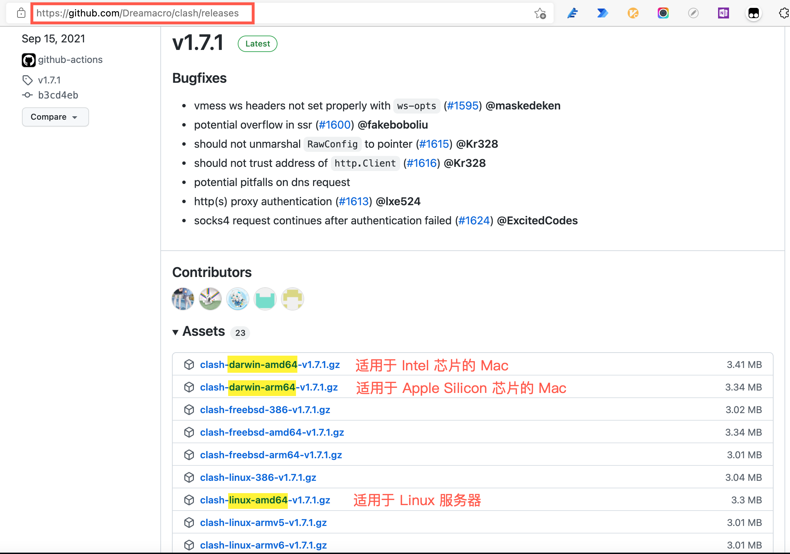

### 下载

在 Clash [release](https://github.com/Dreamacro/clash/releases) 页面下载相应的版本，对于 Ubuntu 一般使用 [clash-linux-amd64](https://github.com/Dreamacro/clash/releases/download/v1.14.0/clash-linux-amd64-v1.14.0.gz) 版本：




```shell
wget https://github.com/Dreamacro/clash/releases/download/v1.14.0/clash-linux-amd64-v1.14.0.gz
```


然后使用 `gunzip` 命令解压，并重命名为 `clash`：

```shell
gunzip clash-linux-amd64-v1.14.0.gz
mv clash-linux-amd64-v1.14.0 clash
```

为 clash 添加可执行权限：

```shell
chmod u+x clash
```

Clash 运行时需要 `Country.mmdb` 文件，当第一次启动 Clash 时（使用 `./clash` 命令） 会自动下载（会下载至 `/home/XXX/.config/clash` 文件夹下）。自动下载可能会因网络原因较慢，可以访问该[链接](https://github.com/Dreamacro/maxmind-geoip/releases)手动下载。

### 配置文件

Clash 提供了 http proxy 和 socks5 proxy 运行在两个不同端口。默认配置下 http proxy 在 7890 端口，而 socks proxy 在 7891 端口。

因为 socks 比 http 代理有更好的性能，而且支持 UDP 协议，所以使用 socks 代理是更佳选择。但同时也要考虑到，有些软件不支持 socks 协议，所以还不能完全丢弃 http。

查一下配置文件 `~/.config/clash/config.yaml` 中的端口号，一般最开头就是：

```yaml
port: 7890
socks-port: 7891
```

第一行的 port 就是 http 端口，第二行 socks-port 很显然就是 socks 端口号。查到端口号，我们在服务器环境里配置一下：

在服务器环境里配置一下：

```shell
vim /etc/profile
```

在文件末尾添加下面内容：

```shell
export http_proxy=http://127.0.0.1:7890
export https_proxy=http://127.0.0.1:7890
export all_proxy=socks5://127.0.0.1:7891
```

保存文件后，使用下面命令使其生效：

```shell
source /etc/profile
```


把config.yaml文件上传到服务器，注意需要在`proxy-groups`下 type为自动选择或者第一个选择是自动选择

inux 系统使用 systemd 作为启动服务器管理机制，首先把 Clash 可执行文件拷贝到 `/usr/local/bin` 目录，相关配置拷贝到 `/etc/clash` 目录。

```shell
sudo cp clash /usr/local/bin
sudo cp config.yaml /usr/local/etc/clash/
sudo cp Country.mmdb /usr/local/etc/clash/
```

### 配置systemd服务

创建 systemd 服务配置文件 `sudo vim /etc/systemd/system/clash.service`：

```config
[Unit]
Description=Clash daemon, A rule-based proxy in Go.
After=network.target

[Service]
Type=simple
Restart=always
ExecStart=/usr/local/bin/clash -d /usr/local/etc/clash

[Install]
WantedBy=multi-user.target
```

使用以下命令，让 Clash 开机自启动：

```shell
sudo systemctl enable clash
```

然后开启 Clash：

```shell
sudo systemctl start clash
```

查看 Clash 日志：

```shell
sudo systemctl status clash
sudo journalctl -xe
```


### 使用代理

#### 利用 `Export` 命令使用代理

Clash 运行后，其在后台监听某一端口。Ubuntu 下使用代理，需要 `export` 命令。根据 config 配置文可以查看到件Clash 代理端口（即config文件中第一行的`port`），设置系统代理命令为：

```shell
export all_proxy=socks5://127.0.0.1:7890
```

可以将该命令添加到 `.bashrc` 中，登陆后该用户自动开启代理。

取消系统代理：

```shell
unset  http_proxy  https_proxy  all_proxy
```

#### git 设置代理

注意这里的端口号与export不同，使用config文件中第二行的`socks-port`

```shell
git config --global http.proxy socks5://127.0.0.1:1081
```


### 外部控制

类似界面

### TUN模式

pass

### 测试

```shell
curl google.com
```

```
<HTML><HEAD><meta http-equiv="content-type" content="text/html;charset=utf-8">
<TITLE>301 Moved</TITLE></HEAD><BODY>
<H1>301 Moved</H1>
The document has moved
<A HREF="http://www.google.com/">here</A>.
</BODY></HTML>
```


### 定期更新

### 定期更新

机场提供给每个用户一个固定的订阅链接，订阅链接指向一个配置文件，配置文件里列出的翻墙服务器不断被封，同时机场也会不断把新的服务器加进来，因此需要经常更新才行。

我们写一个脚本来更新配置文件和IP数据库，然后重启 clash 以加载新的配置：

```bash
# 备份旧配置文件，下载新的并替换
cp ~/.config/clash/config.yaml ~/.config/clash/config.yaml.bak;
wget -O ~/.config/clash/config.yaml https://s.trojanflare.com/clashx/xxxxxxxx-xxxx-xxxx-xxxx-xxxxxxxxxxxx;

# 备份旧 GeoIP 数据库，下载新的并替换
cp ~/.config/clash/Country.mmdb ~/.config/clash/Country.mmdb.bak;
wget -O ~/.config/clash/Country.mmdb https://cdn.jsdelivr.net/gh/Loyalsoldier/geoip@release/Country.mmdb;

# 重启 clash 服务，使以上更新生效
service clash restart;
```

我们把上面的脚本保存到一个位置，例如 `~/script/refresh_clash.sh`，然后定期执行就可以了。大概多久执行一次？一星期一次是比较合理的。我用的 GeoIP 数据库来自于[这个项目](https://github.com/Loyalsoldier/geoip)，从文档上看到，每周四会生成 `Country.mmdb` 文件，那就每周五下载好了。

```shell
crontab -e
```

进入编辑后，在文件末尾加一行：

```shell
# 每周五凌晨三点执行
0 3 * * 5 ~/script/refresh_clash.sh;
```

参考：[在 Linux 中使用 Clash | CodeSwift (iswiftai.com)](https://blog.iswiftai.com/posts/clash-linux/)

[用 Clash 做代理 (maintao.com)](https://maintao.com/2021/use-clash-as-a-proxy/)