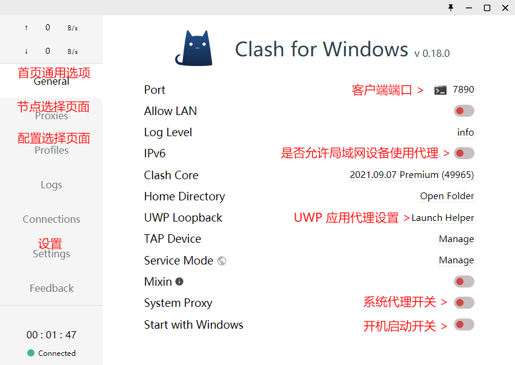
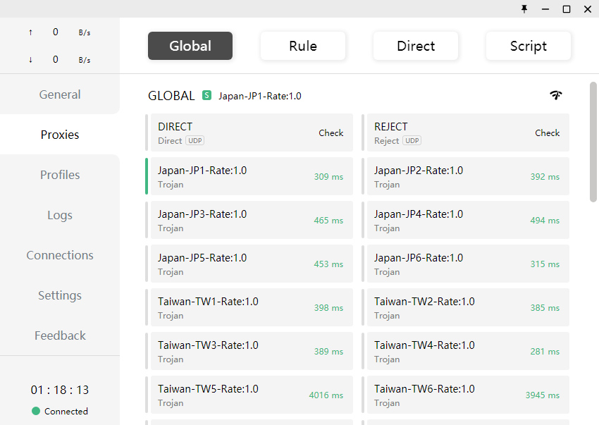

### 0. 优势

- 支持大部分协议
- 内建DNS服务器减少DNS污染，支持伪装域名
- 自建规则选择结点
- 允许用户远程获得节点列表
- 解决win10应用代理问题。

核心优势是分流

### 1. 下载

- 访问 [Github Releases](https://github.com/Fndroid/clash_for_windows_pkg/releases) 下载
- [点击访问同步更新的最新版本客户端](https://repo.yizhihongxing.app/clash_for_windows_pkg/LatestRelease/)
- Windows 下载 Clash.for.Windows.Setup.版本号.exe 文件 
- macOS 下载 Clash.for.Windows-版本号.dmg 文件 

Windows 直接双击打开 exe 文件进行安装，如果提示 `阻止了无法识别的应用启动。` 请点击更多信息，然后再点击仍要运行进行安装。

### 2. 获取配置

- 机场支持 Clash 托管：只需要在 Profile 的面板中，将托管地址复制到输入框中，点击 Download 按钮，即可开始使用

- 即订阅URL：使用 [Subconverter](https://github.com/tindy2013/subconverter) 将 Shadowsocks 订阅转换为 Clash 订阅，或使用在线转换[https://sub-web.wcc.best（基础版即可）](https://sub-web.wcc.best/)。

### 3. 添加配置

#### 系统代理

首先打开 `General` 首页页面, 开启系统代理，确保其他程序也可以使用代理；

打开系统设置，Windows Settings -> Network & Internet -> Proxy，可以看到已经应用到系统代理了。

- 可以修改端口为1080（switch_omega的端口），这样就可以直接使用switch_omega的自动规则。

#### Socks5

应用中需要有 Socks5 代理的设置项，才能为该应用启用代理。为 Chrome 启用 Socks5 代理，需要安装扩展，`Proxy SwitchyOmega`。

### 3. clash代理介绍

然后打开 `Proxies` 代理服务器选择页面。

选择节点后可能没有立即生效，建议返回 `General` 首页页面 点击 `Clash for Windows` 字样通过快速重启客户端重新载入配置。

#### 节点分组

即建立分流策略，一般可在配置文件中实现，即proxy-groups的type

策略组有延迟最低、故障转移、手动选择、负载均衡 四种模式。在proxies中会用首字母表示该proxy-groups的策略。

- 延迟最低（url-teset）：顾名思义，每隔一段时间进行延迟测试，选择延迟最低的节点。

- 故障转移（fallback），每次都选组内第一个节点，无法使用再换到第二个，依次类推。

-  手动选择（select），顾名思义，没有特殊功能。

- 负载均衡(load-balance)，每个节点都用，**由于很多机场都有连接数的限制**，因此实际使用较少。

需要注意的是，有的机场并不喜欢用户进行 url-test 等操作，会给服务器周期性地带来大量连接，如 ssr cloud 就曾对连接数过多的用户进行警告。这时可以选择 select 模式。

- Proxy：表示代理用的节点
- Final：表示没有匹配的规则，走代理还是直连。建议用直连。

参考：[【Windows / macOS】 Clash for Windows 设置方法 - Databáze řešení - 一枝红杏 (yizhihongxing.network)](https://order.yizhihongxing.network/index.php?rp=%2Fknowledgebase%2F27%2FWindows-or-macOS-Clash-for-Windows-设置方法-.html&language=czech#31-通过链接直接添加)

[Clash 教程 (codein.icu)](https://www.codein.icu/clashtutorial/#订阅转换)