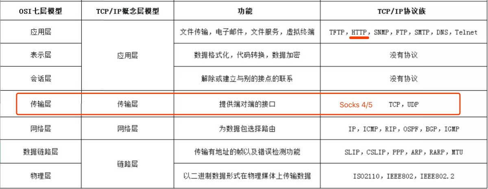

### 问题

linux如何命令行翻墙？这里以ubuntu为例

大概的思路：

- 装v2ray。软件在服务器端和客户端是一样的，唯一的区别是config文件
- v2ray只支持在传输层socks上代理，而很多应用只能在应用层面上用http代理，需要转换软件privoxy（windows下需要开启系统代理）



- 很多软件无法配置代理，直接用proxychains4强制代理

### 1. 安装v2ray

按之前的文件安装。注意install.sh文件需要先下载，但也提供了本地安装的方式：

```shell
sudo bash install.sh -l
```

安装好后启动v2ray服务

```shell
systemctl restart v2ray
```

注意端口问题，端口默认是10808，但config中可以改。

### 2. 安装privoxy

安装privoxy

```shell
sudo apt install -y privoxy
```

修改配置文件/etc/privoxy/config

```
listen-address  :10809 

forward-socks5    /    127.0.0.1:10808  .
```

启动privoxy服务

```shell
systemctl restart privoxy
```

http代理已经启动, **默认端口是10809**, (http://127.0.0.1:10809).


### 3. 配置proxychains

有些linux命令行工具没有配置代理的方法, 可以用proxychains强制应用使用代理网络.

安装proxychains

```
sudo apt install -y proxychains
```

修改配置文件/etc/proxychains.conf最后一行

```
socks5  127.0.0.1 10808
```

使用proxychains方法, 在命令前加上proxychains, 如:

```
proxychains apt update
```


### 4. 使用

#### python pip使用http代理加速


方法1:

```
pip3 install -r requirement.txt --proxy http://127.0.0.1:10809
```

方法2:

```
proxychains pip3 install -r requirement.txt
```

#### git使用http代理加速


方法1:

```
git config --global http.proxy http://127.0.0.1:10809
git config --global https.proxy http://127.0.0.1:10809
```

取消设置

```
git config --global --unset http.proxy
```

方法2:

```
proxychains git clone https://github.com/opencv/opencv.git
```

#### docker使用http代理加速


```
# mkdir /etc/systemd/system/docker.service.d/etc/systemd/system/docker.service.d/http-proxy.conf------[Service]Environment="HTTP_PROXY=http://127.0.0.1:10809/"------# systemctl daemon-reload# systemctl restart docker
```


参考:[在Ubuntu Linux中命令行工具使用代理v2ray privoxy proxychains学习笔记 - Coding.Tools](https://coding.tools/cn/blog/using-proxy-in-linux-ubuntu-with-v2ray-privoxy-proxychains)

