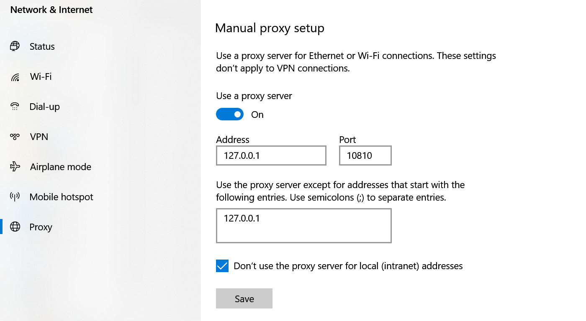

### 安装

从网络下载v2rayN，并且设置服务器（与v2ray一样）

### windows10 系统设置

windows使用http代理（可以让所有应用程序代理）

#### 在客户端中

首先在v2rayN中：设置——参数设置——本地监听端口

这里选择10809，即socks为10809，而http为108010，

#### win10系统设置

在设置——网络——代理

注意端口要和http端口一致，而不是socks端口