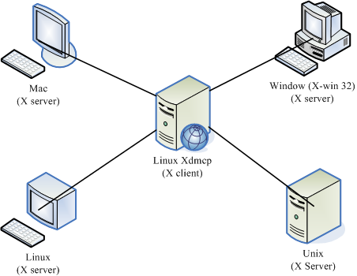

## 1. XDMCP

**X Window System 用在网络上的方式**

当 X server, X client 都在同一部主机上面的时候，你可以很轻松的启动一个完整的 X Window System。 但是如果你想要透过这个机制在网络上面启动 X 呢？此时你得先在客户端启动一个 X server 将图形接口绘图所需要的硬件装置配置好， 并且启动一个 X server 常见的接收埠口 (通常是 port 6000)，然后再由服务器端的 X client 取得绘图数据，再将数据绘制成图啰。 透过这个机制，你可以在任何一部启动 X server 登入服务器喔！而且**不管你的操作系统是啥**呢

**Display Manager (DM)：**提供使用者登入的画面以让用户可以藉由图形接口登入。 在使用者登入后，可透过 display manager 的功能去呼叫其他的 Window manager ，让用户在图形接口的登入过程变得更简单。 由于 DM 也是启动一个等待输入账号密码的图形数据，因此 DM 会主动去唤醒一个 X Server 然后在上头加载等待输入的画面就是了

### Windows用户登陆

 **Xming**

## 2. VNC服务器

VNC server 会在服务器端启动一个监听用户要求的端口，一般端口号码在 5901 ~ 5910 之间。当客户端启动 X server 联机到 5901 之后， VNC server 再将一堆预先设定好的 X client 透过这个联机传递到客户端上，最终就能够在客户端显示服务器的图形接口了。

VNC服务器安装在你的远程机上，客户端在本机

## 3. **仿真的远程桌面系统： XRDP 服务器**

使用上面的图形接口的联机服务器都有一个问题，除了联机机制的不同之外，上头的 Xdmcp 与 VNC 原则上，资料都没有加密。 因此上面的动作大多仅适合局域网络内运作，不要连上 Internet 比较好。

XRDP 服务器：加密的远程连机服务

不过你要注意的是，因为 xrdp 最终会自动启用 VNC ，因此你还是必须要安装 tigervnc-server 才行！ 否则 xrdp 应该还是无法运作的呦！