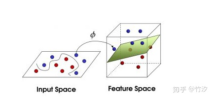
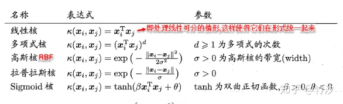

找到最中间的超平面。判定“最适合”的标准就是这条直线离直线两边的数据的间隔最大。所以，得寻找有着最大间隔的超平面

### 函数间隔与几何间隔
在超平面w\*x+b=0确定的情况下，|w\*x+b|能够表示点x到距离超平面的远近，而通过观察w\*x+b的符号与类标记y的符号是否一致可判断分类是否正确，所以，可以用(y\*(w\*x+b))的正负性来判定或表示分类的正确性。于此，我们便引出了函数间隔（functional margin）的概念.  
定义函数间隔：  

但是这样的间隔有问题，如果成比例改变w和b，函数间隔也会改变。

####  几何间隔

1. 点到直线的距离
$$d=\frac{w^T x+b}{||w||}$$  
若超平面(w,b)可以使样本正确分类，那么：
对(xi,yi)属于D,yi=+1,则w^Tx_i+b>0;  
yi=-1,则w^Tx_i+b<0;（选择+1和-1使数学上好计算）令 

这意味着最近的点距离超平面是单位1；  
对于支持向量的点，满足y(w^T x+b)=1；  
而对于所有不是支持向量的点，大于1；
样本中点x到超平面（w,b）的距离：  

## SMO算法

下面要解决的问题是：在$\alpha$上求上述目标函数的最小值。为了求解这些乘子，每次从中任意抽取两个乘子$\alpha_i$和$\alpha_j$，然后固定其它乘子，使得目标函数只是关于$\alpha_i$和$\alpha_j$的函数。这样，不断的从一堆乘子中任意抽取两个求解，不断的迭代求解子问题，最终达到求解原问题的目的。$K$为核函数

### 核函数

到现在为止，之前我们说的假设样本都是线性可分的，然而在现实任务中样本空间内也许并不存在一个能正确划分两类样本的超平面。

重点来了：

**既然在低维的时候不可分，那我们映射到高维呢。**

一般地，解决线性不可分问题时，常常采用**映射**的方式，将低维原始空间映射到高维特征空间，使得数据集在高维空间中变得线性可分，从而再使用线性学习器分类。如果原始空间为有限维，即属性数有限，那么总是存在一个高维特征空间使得样本线性可分。

#### 参考文献

[支持向量机通俗导论](https://blog.csdn.net/v_JULY_v/article/details/7624837)

[《Machine Learning》 学习笔记系列六 支持向量机 - 知乎 (zhihu.com)](https://zhuanlan.zhihu.com/p/72984168)