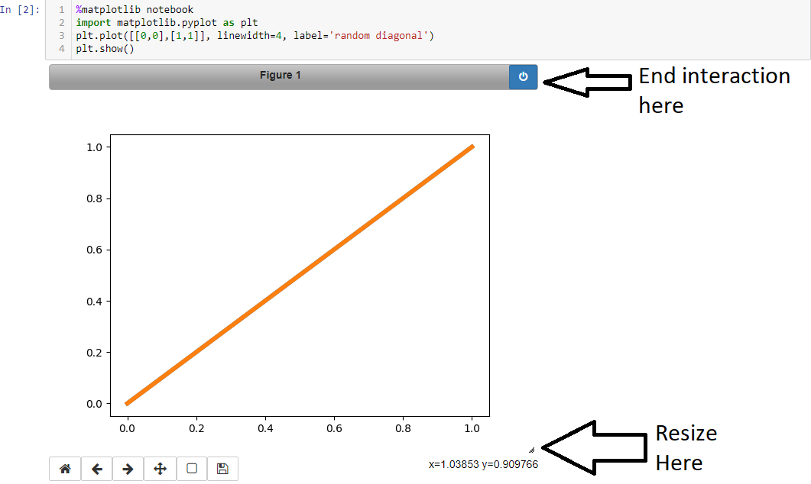

```python
%matplotlib notebook
```

- 获得可缩放和可调整大小的笔记本。这对于需要交互工作的快速测试来说是最好的。 
- ***BUG\****：只能激活一个可缩放的cell。如果在另一个cell中使用可能有奇怪的bug。如果您的代码中有生成绘图的循环，这真的很糟糕



#### 2.

```python
%matplotlib ipympl
```

supposedly like `%matplotlib notebook` but kept more up to date, in my experience that is more or less the same and I am actually missing the ability to resize at the plot. The g[ithub for ipympl](https://github.com/matplotlib/jupyter-matplotlib) was last updated 5 month ago at the time of writing so although the [official matplotlib documentation](https://matplotlib.org/tutorials/introductory/usage.html#backends) suggests the jupyter ecosystem is moving too fast and it is better to this this I recommend not to use ipympl

不太建议

#### 3.

```python
%matplotlib inline
```
- this only draws the images, not interactive / zoom-able but it works well. I recommend to change figure size to be bigger than the default in most cases (see notes below on how).

功能是可以内嵌绘图，并且可以省略掉plt.show()这一步。


参考：https://medium.com/@1522933668924/using-matplotlib-in-jupyter-notebooks-comparing-methods-and-some-tips-python-c38e85b40ba1

