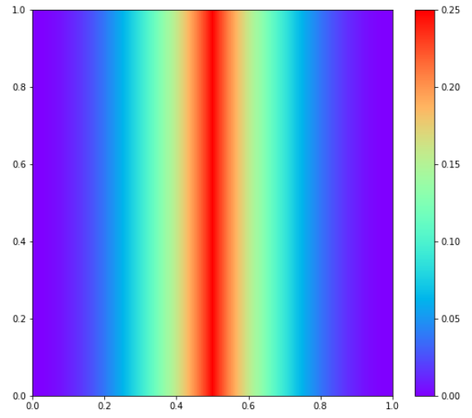
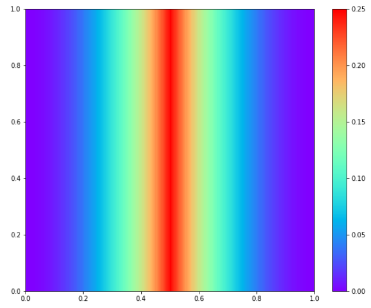

#### 网格化

```python
from scipy.interpolate import griddata

X, Y = np.meshgrid(x,y)
X_star = np.hstack((X.flatten()[:,None],Y.flatten()[:,None]))
U_pred = griddata(X_star, u_pred.flatten(), (X, Y), method='cubic')
```

#### imshow绘图

```python
fig = plt.figure(figsize=(20,8))
ax = plt.subplot(1,2,1)
h = ax.imshow(u, interpolation='nearest', cmap='rainbow', 
              extent=[y.min(), y.max(), x.min(), x.max()], 
              origin='lower', aspect='auto')

fig.colorbar(h)
```



#### pcolormesh

```python
fig = plt.figure(figsize=(20,8))
ax = plt.subplot(1,2,1)
h = ax.imshow(X, Y, u, cmap='rainbow')

fig.colorbar(h)
```



#### pcolor

pcolormesh更快，

使用mask的时候不太一样。


#### 三者区别

`imshow`要求数据是方阵格式

pclormesh不需要，只要是矩形；


imshow的y轴会默认翻转，会自动插值？

pcolormesh把数组当作一个个cell，当mesh是non-uniform，适合查看边界？