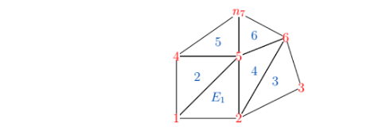

绘制有限元网格

### 关键函数 tricolor

数据：

```python
# x,y position
import numpy as np
import matplotlib.pyplot as plt
# x, y position
nodes= np.array([
        [0.000, 0.000],
        [1.000, 0.000],
        [2.000, 0.500],
        [0.000, 1.000],
        [1.000, 1.000],
        [1.750, 1.300],
        [1.000, 1.700]])
x, y = nodes.T
# three edges of a triange
eles = np.array([
        [1, 2, 5],
        [5, 4, 1],
        [2, 3, 6],
        [6, 5, 2],
        [4, 5, 7],
        [5, 6, 7]])
# value
node_vals = [1, 2, 1, 2, 7, 4, 5]
```




**绘图**：

```python
# contour
# 减1是因为索引
plt.tricontourf(x, y, eles - 1, node_vals)
plt.colorbar()
plt.show()
```

```python
# surface, like pcolor
plt.tricolor(x, y, eles - 1, node_vals)
plt.colorbar()
plt.show()
```

[python - Efficiently plot a finite element mesh solution with Matplotlib - Computational Science Stack Exchange](https://scicomp.stackexchange.com/questions/31463/efficiently-plot-a-finite-element-mesh-solution-with-matplotlib)

### 三角形形边的生成

```python
matplotlib.tri.Triangulation(x, y, triangles=None, mask=None)
```

```python
eles = tri.Triangulation(x, y)
```


返回的就是上面的eles

[matplotlib.tri — Matplotlib 3.4.3 documentation](https://matplotlib.org/stable/api/tri_api.html#matplotlib.tri.Triangulation.get_masked_triangles)

[TrPiLooDemo — Matplotlib 3.3.3 文档 (osgeo.cn)](https://www.osgeo.cn/matplotlib/gallery/images_contours_and_fields/tripcolor_demo.html#sphx-glr-gallery-images-contours-and-fields-tripcolor-demo-py)

[matplotlib.tri — Matplotlib 3.3.3 文档 (osgeo.cn)](https://www.osgeo.cn/matplotlib/api/tri_api.html#matplotlib.tri.Triangulation)