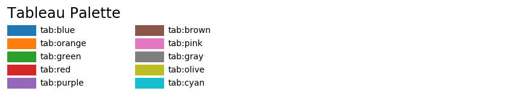

```python
plot(x, y1, color="r", linestyle="-", marker="^", linewidth=1, label="y1")
```


### 0. color

base color使用引号包括起来使用，

tab color则直接用`table:blue`使用




[List of named colors — Matplotlib 3.1.0 documentation](https://matplotlib.org/3.1.0/gallery/color/named_colors.html)

### 1. linestyle

#### named linestyles

- 'solid'

- 'dotted'

- 'dashed'

- 'dashdot'

#### parameterized linestyle

```python
linestyle_tuple = [
     ('loosely dotted',        (0, (1, 10))),
     ('dotted',                (0, (1, 1))),
     ('densely dotted',        (0, (1, 1))),

     ('loosely dashed',        (0, (5, 10))),
     ('dashed',                (0, (5, 5))),
     ('densely dashed',        (0, (5, 1))),

     ('loosely dashdotted',    (0, (3, 10, 1, 10))),
     ('dashdotted',            (0, (3, 5, 1, 5))),
     ('densely dashdotted',    (0, (3, 1, 1, 1))),

     ('dashdotdotted',         (0, (3, 5, 1, 5, 1, 5))),
     ('loosely dashdotdotted', (0, (3, 10, 1, 10, 1, 10))),
     ('densely dashdotdotted', (0, (3, 1, 1, 1, 1, 1)))]
#e.g. 
linestyle=(0, (1, 10))
```


[Linestyles — Matplotlib 3.5.0 documentation](https://matplotlib.org/stable/gallery/lines_bars_and_markers/linestyles.html)

### 2. marker


[matplotlib.markers — Matplotlib 3.5.0 documentation](https://matplotlib.org/stable/api/markers_api.html)