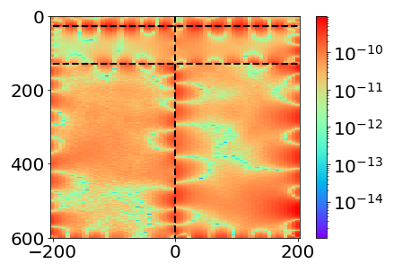

### 色标为对数

```python
import matplotlib.colors as colors
```


可以用于`pcolor`和`pcolormesh`

```python
error_i = np.abs(u_pred.imag-U.imag)
h = ax.pcolormesh(Y/1e3,Z/1e3,error_i , \
                  norm=colors.LogNorm(vmin=error_i.min(), vmax=error_i.max()),\
                                      cmap='rainbow',shading='auto')
```

