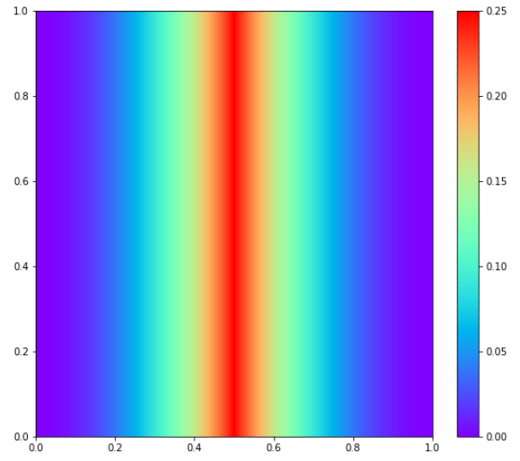
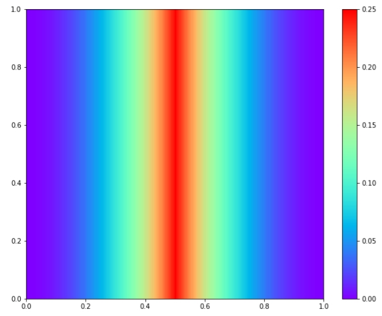

#### 网格化

```python
from scipy.interpolate import griddata

X, Y = np.meshgrid(x,y)
X_star = np.hstack((X.flatten()[:,None],Y.flatten()[:,None]))
U_pred = griddata(X_star, u_pred.flatten(), (X, Y), method='cubic')
```

#### imshow绘图

```python
fig = plt.figure(figsize=(20,8))
ax = plt.subplot(1,2,1)
h = ax.imshow(u, interpolation='nearest', cmap='rainbow', 
              extent=[y.min(), y.max(), x.min(), x.max()], 
              origin='lower', aspect='auto')

fig.colorbar(h)
```



#### pcolormesh

```python
fig = plt.figure(figsize=(20,8))
ax = plt.subplot(1,2,1)
h = ax.p(X, Y, u, cmap='rainbow')

fig.colorbar(h)
```



**网格**：

绘图值C的尺寸为(nrows, ncolumns)，其中列数和x的大小一样，行数和Y一样。

#### pcolor

pcolormesh更快，

使用mask的时候不太一样。


#### 三者区别

`imshow`要求数据是方阵格式

pclormesh不需要，只要是矩形；


imshow的y轴会默认翻转，会自动插值？

pcolormesh把数组当作一个个cell，当mesh是non-uniform，适合查看边界？

## imshow vs pcolormesh

标准网格（grid大小一样）用imshow，大小不一致用pcolormesh

Fundamentally, `imshow` assumes that all data elements in your array are to be rendered at the same size, whereas `pcolormesh`/`pcolor` associates elements of the data array with rectangular elements whose size may vary over the rectangular grid.

If your mesh elements are uniform, then `imshow` with interpolation set to "nearest" will look very similar to the default `pcolormesh` display (without the optional `X` and `Y` args). The obvious differences are that the `imshow` y-axis will be inverted (w.r.t. `pcolormesh`) and the aspect ratio is maintained, although those characteristics can be altered to look like the `pcolormesh` output as well.

From a practical point of view, `pcolormesh` is more convenient if you want to visualize the data array as cells, particularly when the rectangular mesh is non-uniform or when you want to plot the boundaries/edges of the cells. Otherwise, `imshow` is more convenient if you have a fixed cell size, want to maintain aspect ratio, want control over pixel interpolation, or want to specify RGB values directly.

reference: [https://stackoverflow.com/questions/21166679/when-to-use-imshow-over-pcolormesh#:~:text=1%20Answer&text=Fundamentally%2C%20imshow%20assumes%20that%20all,vary%20over%20the%20rectangular%20grid.](