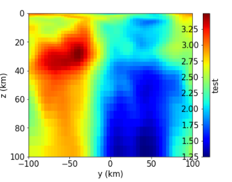

### 绘制色标

#### 一个色标

```python
fig.colorbar(h)
```


#### 两个图共用色标

主要是增加ax轴

共用同一个norm

```python
fig = plt.figure(figsize=(18,6))
ax = plt.subplot(1,2,1)
norm = colors.LogNorm(vmin=1/Sigma.min(), vmax=1/Sigma.max())
h = ax.pcolormesh(Y/1e3,Z/1e3, 1/Sigma, norm=norm,
                  cmap='rainbow',shading='auto')
line_z = np.linspace(y.min()/1e3, y.max()/1e3, 2)[:,None]
for ii in range(1,len(BCz)-1):
    ax.plot(line_z, z[BCz[ii]]*np.ones((2,1))/1e3,color='.75', linestyle='--',linewidth = 2)
line_y = np.linspace(z.min()/1e3, z.max()/1e3, 2)[:,None]
for ii in range(1,len(BCy)-1):
    ax.plot(y[BCy[ii]]*np.ones((2,1))/1e3, line_y, color='.75', linestyle='--',linewidth = 2)
ax.invert_yaxis()

ax.set_xlabel("y(km)")
ax.set_ylabel("z(km)")

ax1 = plt.subplot(1,2,2)
h1 = ax1.pcolormesh(Y[BCz[1]:,BCy[1]:BCy[2]]/1e3,Z[BCz[1]:,BCy[1]:BCy[2]]/1e3, 1/Sigma[BCz[1]:,BCy[1]:BCy[2]], 
                  norm=norm,
                  cmap='rainbow',shading='auto')

ax1.invert_yaxis()

ax1.set_xlabel("y(km)")
# ax1.set_ylabel("z(km)")
# cbar = fig.colorbar(h)
# cbar.ax.set_ylabel(r'resistivity ($\Omega m$)', rotation=90)
cbar = fig.colorbar(h,ax=[ax,ax1])
cbar.ax.set_ylabel(r'resistivity ($\Omega m$)', rotation=90)
# plt.savefig("./imag/CM2D0_media.jpg", dpi=300,bbox_inches='tight',pad_inches=0.1)

plt.show()
```

### 单独增加一个色标

```python
h = ax.pcolormesh(yn0/1e3,zn0/1e3,sig2, 
                  norm=norm,#colors.LogNorm(vmin=sig0.min(), vmax=sig0.max()),
                  )
fig.subplots_adjust(right=0.8)
cbar_ax = fig.add_axes([0.85, 0.15, 0.01, 0.7])
fig.colorbar(h, cax=cbar_ax,label=r'$\rho(\Omega\cdot m)$')
```

注意，line4 表示把最右端设置为0.8

line5设置colorbar的[pos_x, pos_y,  len_x, len_y]

### label和tick分别在一边

label可以用colorbar中的location色湖之

而tick而需要用

```pythob
cbar = fig.colorbar(h)
cbar.ax.yaxis.set_ticks_position('left')
```


