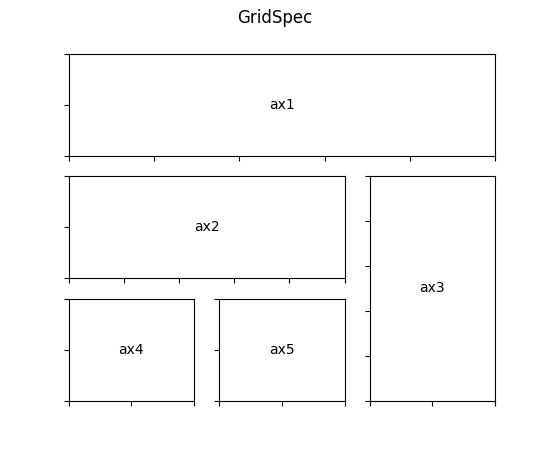

#### GridSpec：指定子图位置

```python
import matplotlib.gridspec as gridspec
```

```python
gs = gridspec.GridSpec(3, 3)
# top=1-0.06, bottom=1-1/3, left=0.15, right=0.85, wspace=0.2
ax1 = plt.subplot(gs[0, :])
ax2 = plt.subplot(gs[1,:-1])
ax3 = plt.subplot(gs[1:, -1])
ax4 = plt.subplot(gs[-1,0])
ax5 = plt.subplot(gs[-1,-2])
```



#### update参数

**left, right, top, bottom**(float or None, optional): Extent of the subplots as a fraction of figure width or height; 以左下角为原点，图框4个点相对原点的位置，

**wspace, hspace **(float, optional):  Spacing between the subplots as a fraction of the average subplot width / height.。 子图之间的宽度和高度。

## imshow vs pcolormesh

标准网格（grid大小一样）用imshow，大小不一致用pcolormesh

Fundamentally, `imshow` assumes that all data elements in your array are to be rendered at the same size, whereas `pcolormesh`/`pcolor` associates elements of the data array with rectangular elements whose size may vary over the rectangular grid.

If your mesh elements are uniform, then `imshow` with interpolation set to "nearest" will look very similar to the default `pcolormesh` display (without the optional `X` and `Y` args). The obvious differences are that the `imshow` y-axis will be inverted (w.r.t. `pcolormesh`) and the aspect ratio is maintained, although those characteristics can be altered to look like the `pcolormesh` output as well.

From a practical point of view, `pcolormesh` is more convenient if you want to visualize the data array as cells, particularly when the rectangular mesh is non-uniform or when you want to plot the boundaries/edges of the cells. Otherwise, `imshow` is more convenient if you have a fixed cell size, want to maintain aspect ratio, want control over pixel interpolation, or want to specify RGB values directly.

reference: [https://stackoverflow.com/questions/21166679/when-to-use-imshow-over-pcolormesh#:~:text=1%20Answer&text=Fundamentally%2C%20imshow%20assumes%20that%20all,vary%20over%20the%20rectangular%20grid.](https://stackoverflow.com/questions/21166679/when-to-use-imshow-over-pcolormesh#:~:text=1 Answer&text=Fundamentally%2C imshow assumes that all,vary over the rectangular grid.)