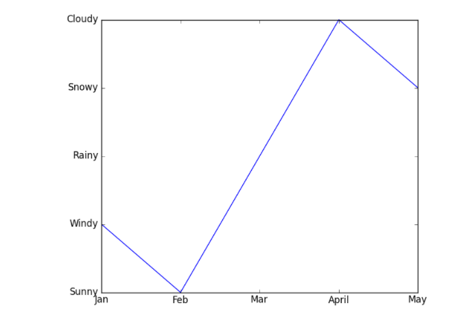

```python
plt.rcParams['xtick.labelsize'] = 20
plt.rcParams['ytick.labelsize'] = 20
plt.rcParams['axes.labelsize'] = 20
```

保证所有字体一样大，尤其是出现1e-9这种刻度时


**坐标轴使用科学计数法表示刻度**

```python
ax.xaxis.get_major_formatter().set_powerlimits((0,1))
```


## [修改 `rcParams` 字典的默认值](https://www.delftstack.com/zh/howto/matplotlib/how-to-set-the-figure-title-and-axes-labels-font-size-in-matplotlib/#修改-rcparams-字典的默认值)

我们可以更改存储在名为 `matplotlib.rcParams` 的全局字典式变量中的默认 `rc` 设置，以设置 Matplotlib 中标签的字体大小和图表标题。

[`rcParams`](https://matplotlib.org/3.1.1/tutorials/introductory/customizing.html#the-matplotlibrc-file) 的结构：

可以通过 `plt.rcParams.keys()` 函数获取 `rcParams` 键的完整列表。

| 键                      | 描述                                             |
| :---------------------- | :----------------------------------------------- |
| `axes.labelsize`        | x 和 y 标签的字体大小                            |
| `axes.titlesize`        | 轴标题的字体大小                                 |
| `figure.titlesize`      | 图形标题的大小（`figure.suptitle()`）            |
| `xtick.labelsize`       | 刻度标签的字体大小                               |
| `ytick.labelsize`       | 刻度标签的字体大小                               |
| `legend.fontsize`       | 图例的字体大小（`plt.legend()`，`fig.legend()`） |
| `legend.title_fontsize` | 图例标题的字体大小，无设置为默认轴。             |
| `axes.linewidth`        | 轴的宽度                                         |
| `xtick.major.width`     | X主轴刻度宽度                                    |
| `xtick.minor.width`     | X次轴刻度宽度                                    |

```python
import numpy as np
import matplotlib.pyplot as plt

x=np.linspace(0,5,100)
y= np.sin(2 * np.pi * x)

parameters = {'axes.labelsize': 25,
          'axes.titlesize': 35}
plt.rcParams.update(parameters)

fig = plt.figure(figsize=(8, 6))
plt.plot(x,y)
plt.title('Plot of sinx')
plt.xlabel('x')
plt.ylabel('sinx')

plt.show()
```

### 自定义轴标签

```python
fig = plt.figure()
ax = fig.add_subplot(1, 1, 1)

xticks=['Jan','Feb','Mar','April','May']
x=[1,2,3,4,5]
yticks = ['Windy', 'Sunny', 'Rainy', 'Cloudy', 'Snowy']
y=[2,1,3,5,4]

plt.plot(x,y,'b-', marker = 'o') #.2,.1,.7,.8
plt.subplots_adjust(left =0.2)

plt.xticks(x,xticks)
plt.yticks(y,yticks)
ax.set_ylim(0.5,max(y))
plt.show()
```



### 轴刻度向内

```python
ax.tick_params(axis='both',which='both',direction='in')

```

### 轴刻度和标签位置

```python

ax.yaxis.tick_right()
ax.yaxis.set_label_position("right")
```

