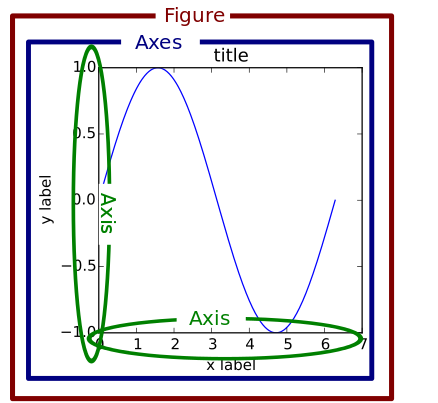
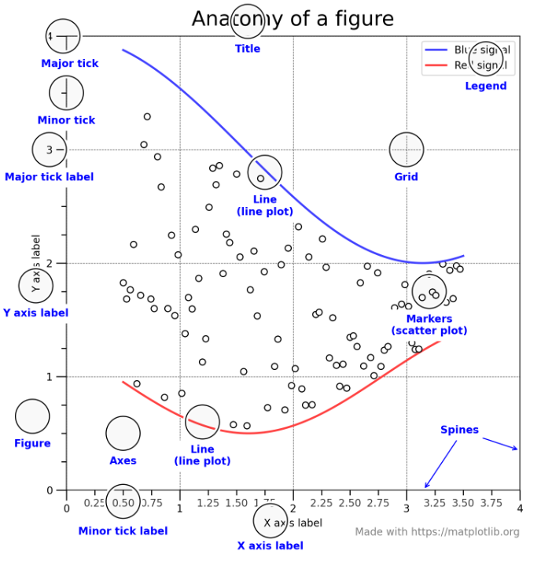
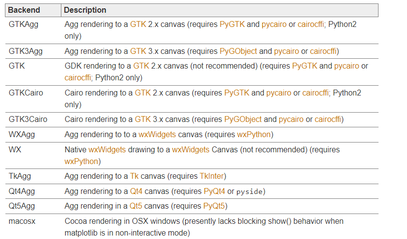

### 图像属性

#### backend?

绘图后台：pygtk, wxpython, tkinter, qt4, or macosx;

### 全局属性

[Customizing Matplotlib with style sheets and rcParams — Matplotlib 3.5.1 documentation](https://matplotlib.org/stable/tutorials/introductory/customizing.html)

[Basic Usage — Matplotlib 3.5.1 documentation](https://matplotlib.org/stable/tutorials/introductory/usage.html)