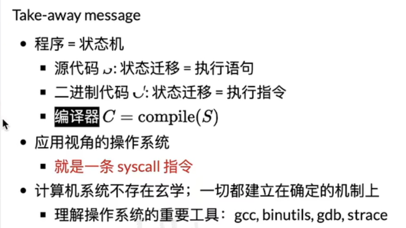

### 状态机

数字逻辑电路

- 状态 = 寄存器保存的值
- 初始状态 = RESER
- 迁移 = 组合逻辑电路计算寄存器下一周期的值

### C程序的语义

状态机，由多个栈表构成（函数调用形成一个新的栈，函数返回是pop栈顶）

### 机器码语义

程序=计算+syscall

syscall把整个程序交给操作系统，实现交互

- 文件操作
- 创建、销毁进程

### 构建最小hello world

#### 解决异常退出

调用syscall

