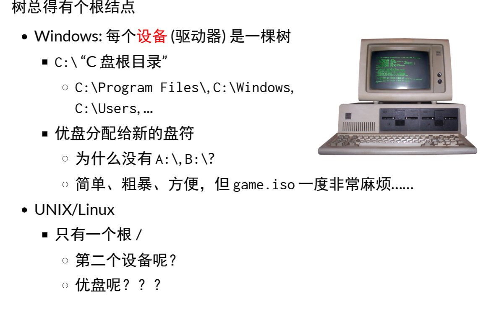

### 共享存储设备

把磁盘抽象成多个虚拟磁盘，每个应用程序单独持有。

### 文件系统

#### 虚拟磁盘的命名

文件系统的根：

#### 目录树的拼接

允许目录挂载一个设备代表的目录树

比如：`mount /dev/sdb /mnt`把sdb设备挂载到mnt目录上

### 目录API

FHS（filesystem hierarchy standard）

硬连接：不同文件指针指向同一个文件位置

软连接：windows的快捷方式。软连接是一个文件，引用它时回去寻找另一个文件。（该文件可以不存在）

### 文件API

每一个文件时一个虚拟磁盘；

### 文件描述符

每次读写后，文件描述符会偏移。