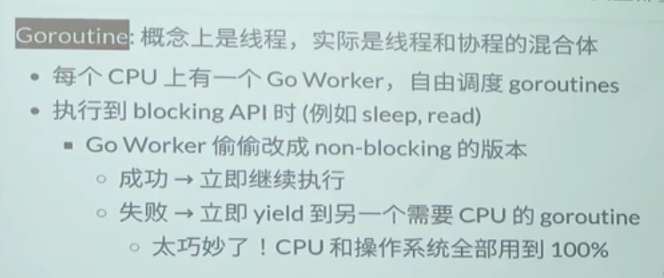

### 1. 高性能计算

关键在于任务分解

机器（节点）——线程 两级结构

线程间通信

任务具有局部性，易于分解；

### 2. 数据中心

#### 挑战

- 数据一致性
- 服务一直可用
- 容忍机器离线  

#### 工具

**线程**：

**协程**（coroutines）：没有系统调用、保存资源更少。但是遇到系统调用，会使同一线程里所有协程block。

### go语言

专为多处理器并行和轻量级并发。

一个CPU只有一个Go worker，不同CPU之间不切换；

#### 内存管理

很少使用共享内存，

而是使用channel。

channel有push（生产者）和pull（消费者）。

### 3. 人机交互程序

 异步事件模型：单线程+事件模式

改善：流程图