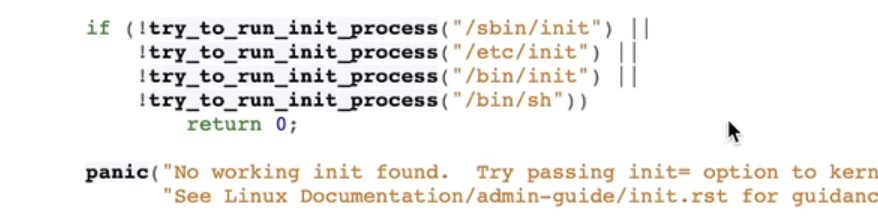
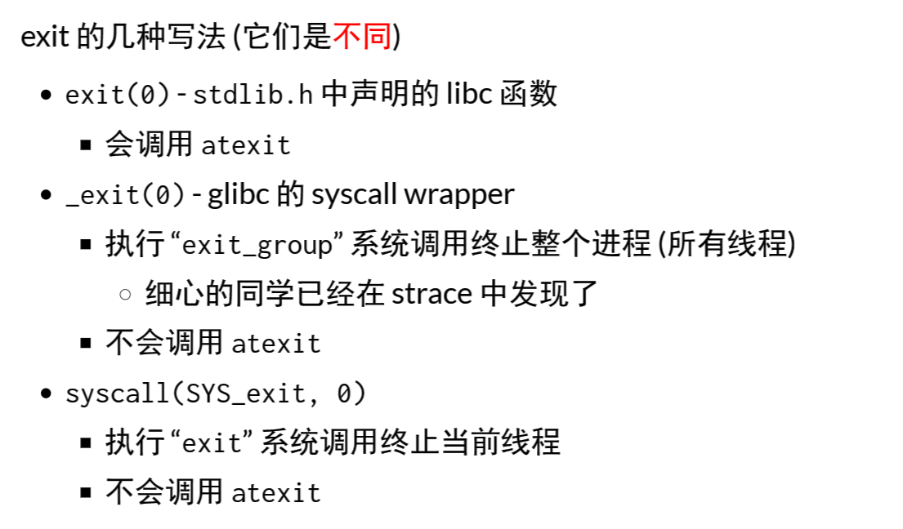

### 从系统启动到第一个进程

系统启动：CPU reset——firmware——boot loader——Kernel_start()

#### RTFSC

指定启动选项`init=`，按照默认列表尝试一遍

之后，Linux kernel就进入后台，处理程序中断等

### fork()

创建进程。

### execve()

将当前运行的状态机重置为另一个程序的初始状态

### exit()

销毁状态机。

对于多线程：

