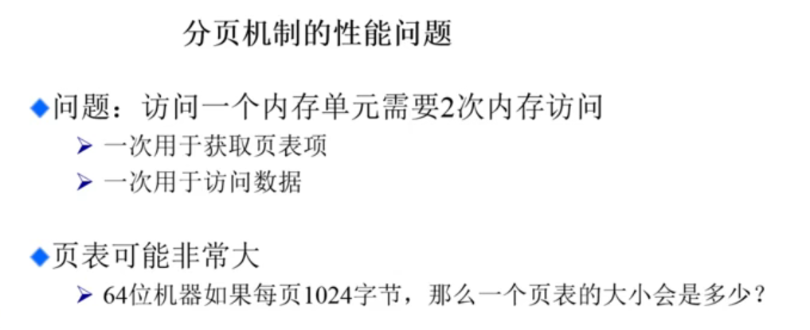

## 基本硬件结构

### CPU

缓存无法被OS管理。

### 内存

存放代码和数据

### 设备

I/O、屏幕等设备

## 工作目标

### 抽象

管理内存空间、逻辑地址空间

- 物理地址空间：主存+硬盘
- 逻辑地址空间：一维地址表

### 连续内存分配

#### 内存动态分配算法

- 最先：找到第一个大于所需尺寸的空闲内存
- 最优：找到最接近所需内存的空闲内存
- 最差：找到最大的空闲空间。

#### 减少内存碎片

- 压缩式碎片整理：将程序内存拷贝到另一地址，合并空闲空间。开销很大。
- 交换式：把硬盘当作虚拟内存，把暂不运行的程序放入硬盘。

### 非连续内存分配

#### 优点

更好的内存利用

共享

支持动态和静态库

#### 缺点

建立虚拟地址和物理地址之间的转换；

#### 分段管理

程序可以分解为多个不同的内存段；

更好地分离和共享。

**寻址方案**：

段大小可变

#### 分页

划分物理内存至固定大小帧（frame）

划分逻辑地址空间至相同大小的页（page）

### 保护

建立地址空间

### 共享

访问相同内存

### 虚拟化

更多地址空间（虚拟内存）

