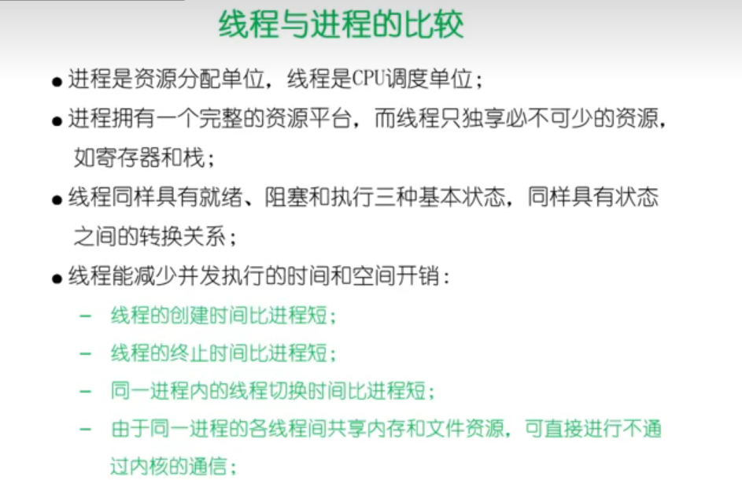

### 进程的缺陷

通信和共享数据困难、维护进程的开销大

### 线程

- 并发执行；
- 共享相同的地址空间；
- 一个线程崩溃，会导致其所属进程的所有线程崩溃。

进程=线程+资源管理

### 用户线程

用户线程的维护由线程库函数完成。

### 内核线程

TCB放在内核中管理；

切换开销大

windows

### 轻量级进程

Solaris/Linux

内核支持的用户线程。一个进程可有一个或多个轻量级进程，每个进程各有一个单独的内核线程来支持

