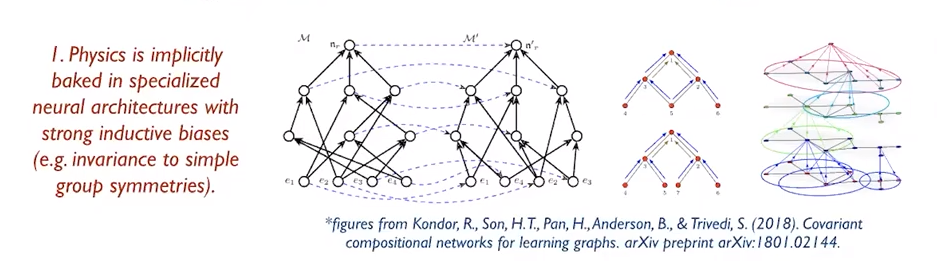
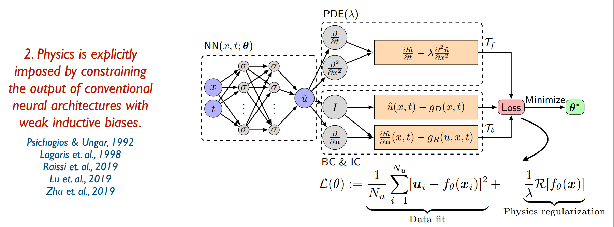
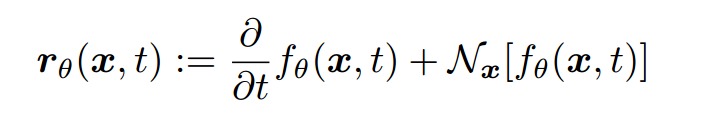
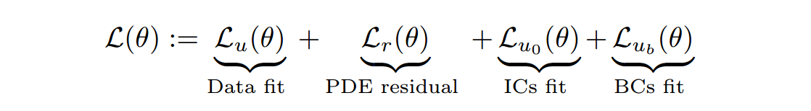
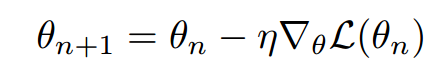
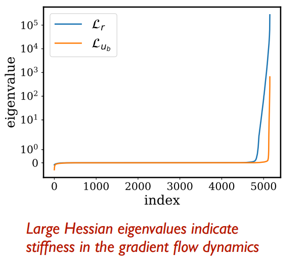

## 1. two school of thought

#### 1. implicitly baked in specialized neural architectures

good at generalize and extrapolate;

disadvantages: computational complexity and not use-friendly.

#### 2. PINN

## 2. PINNs基本步骤

设置residual of PDE

loss function

training via SGD

## 3. 近期进展

2017~2020

- discovery of ODE
- discovery of PDE(Raissi, M., 2018)
- High-dimensional PDE  (100-dimesions. Raissi, M., 2018)
- Stochastic PDEs  (adversarial uncertainty quantification )
- Fractional PDEs  
- Surrogate modeling & high-dimensional UQ  
- Multi-fidelity modeling for stochastic systems
- integrated software

## 4. improvement

An “unconventional” regularizer/prior that requires us to revisit standard deep learning practices:
• loss functions (e.g., square residual, variational principle, Hamiltonian, etc.?)
• network initialization (e.g., Glorot, adaptive?)
• normalization (e.g., zero-mean/unit-variance, PDE solution bounds?)
• optimization (e.g., Adam, adaptive learning rates, proximal algorithms, meta-learning?)
• network architecture (e.g., fully connected, residual/recurrent/convolutional layers, attention?)  

