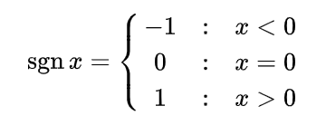

#### 1. 符号函数

`sgn`




#### 2. 单位阶跃函数

`numpy.heaviside`

The Heaviside step function is defined as:

```
                      0   if x1 < 0
heaviside(x1, x2) =  x2   if x1 == 0
                      1   if x1 > 0
```

```python
np.heaviside([-1.5, 0, 2.0], 0.5)
array([ 0. ,  0.5,  1. ])
```


#### 3. 分段函数

`numpy.piecewise(x, condlist, funclist, *args, **kw)`

复杂条件句：
$$
    f(x) =
        \begin{cases}
            10,  & \text{if 1<=x<3} \\
            11,  & \text{if 3<=x<5} \\
            12,  & \text{if 5<=x<7} \\
            13,  & \text{if 7<=x<9} \\
        \end{cases}
$$


```shell
>>> b
array([10, 11, 12, 13, 14])
>>> a
array([1., 3., 5., 7., 9.])
>>> x
array([ 2.,  4.,  6.,  8., 10.])
>>> np.piecewise(x,[(x>=a[i])&(x<a[i+1]) for i in range(4)],[b[i] for i in range(4)])
array([10., 11., 12., 13.,  0.])
```


参考：https://numpy.org/doc/stable/reference/generated/numpy.piecewise.html