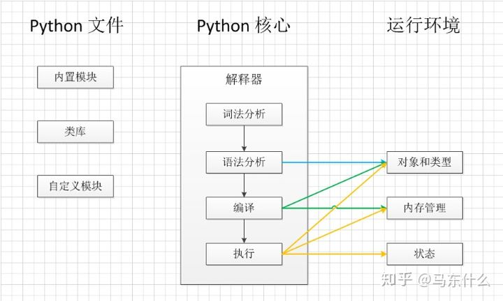

## python编译

1. 词法分析：避免语法错误
2. 生成字节码：.pyc文件。字节码在Python虚拟机程序里对应的是PyCodeObject对象。**.pyc文件是字节码在磁盘上的表现形式**。简单来说就是在编译代码的过程中，首先会将代码中的函数、类等对象分类处理，然后生成字节码文件。有了字节码文件，通过python的解释器对字节码进行解释，将每一行的字节码解释成CPU可以直接识别的机器码，执行。

常见的cpython解释器是用c语言的方式来解释字节码的，**而numba则是使用LLVM编译技术来解释字节码的**

LLVM是一个编译器，它采用代码的特殊中间表示（IR）并将其编译为本机（机器）代码。编译过程涉及许多额外的传递，**其中LLVM编译器可以优化IR。LLVM工具链非常擅长优化IR，因此它不仅可以编译Numba的代码，还可以优化它。**

## 编译器

###  1. cpython

Python编程语言的默认实现是Cpython。顾名思义，Cpython是用C语言编写的。Cpython将python源代码编译为中间字节码，该字节码由Cpython虚拟机执行。CPython附带了一个大型标准库，该库使用C和Python混合编写。CPython提供了与Python包和C扩展模块的最高兼容性。由于CPython是参考实现，因此所有版本的Python语言都使用C语言实现。

注意，**cpython和cython不是一个东西，cpython是python的一种解释器（python虚拟机），它是用c语言来实现的**；cython是python的C拓展语言

### 2. **pypy**

PyPy是用Python编写的Python编程语言的实现。解释器使用RPython（Python的子集）编写。

目前我们接触的比较多的基本上是cpython，其它解释器的实现都存在着一些问题，这里也是路径依赖的问题，迁移很麻烦，而且某些Python模块（如）lxml，只有Cpython中具有必需的组件，它们在Jython中无法使用，因此cpython至少目前在机器学习领域的领袖地位还是难以取代的；

## 为什么python慢

### 1. 动态变量

变量不需要预先定义和分配内存

所有变量都是对象

### 2. 大量重复编译

编译型语言，可以一次编译，下次使用直接运行，而python这种解释性语言，每次运行的时候都要重新将源代码通过解释器转化为机器码；

### 3. gil锁

#### 3.1 并行和并发

**并发：**即一个cpu具有处理多个任务的能力，对于单核cpu来说，只能实现并发；

**并行：**单核无法实现并行，多核可以实现并行和并发，并行执行是指计算机在多核上真正意义上实现多个任务同时进行

#### 3.2 同步和异步

同步和异步的概念是从**通信层面**出发引出的概念：

同步：一个大的任务切分成多个子任务，每个子任务之间存在先后依赖的关系，则为同步机制，例如我们要先烧水再洗澡最后吹头发，三者之间必须严格按照先后顺序执行；

异步：一个大的任务切分为多个子任务，子任务之间并不全存在先后依赖的关系，则为异步机制，例如我们先烧水，烧水的时候可以把脏衣服扔洗衣机里洗了，然后再洗澡吹头发

#### 3.3 线程和进程

进程包含线程，一个进程中可以有多个线程

**进程**：进程表示程序正在执行，其中，进程过程控制块控制着任何的程序操作，进程控制模块包含有关进程的信息，例如进程优先级，进程ID，进程状态，CPU，内存占用等，很多情况下进程与进程之间不共享数据

**线程：** 线程是进程的一部分，意味着一个进程可以具有多个线程，当然也可以是不同进程的多个进程，线程具有3种状态：运行，就绪和阻塞。

gil锁针对的是线程级别的“锁”，因为线程可以进行数据共享，如果线程1定义了变量a，而线程2不小心删除了变量a就会导致程序出现bug，因此gil锁每次仅仅允许一个线程持有python解释器（python虚拟机）的解释权，因为gil针对的是线程，所以我们通过多进程的方式就可以避开gil锁的限制，例如multiprocessing或者joblib中的多进程并行功能，适用于机器学习这种计算密集型的任务

参考：[为什么python这么慢？numba解决了什么问题？ - 知乎 (zhihu.com)](https://zhuanlan.zhihu.com/p/348315009)

### namba

### Numba的优点：

- 便于使用
- 自动并行化
- 支持numpy操作和对象
- 支持调用GPU

### Numba的缺点：

- debug非常麻烦
- 无法在`nopython`模式下与Python及其模块进行交互，numba目前在nopython模式下支持python模块有限，比如pandas是不支持的，但是不支持意味着无法加速并不意味着不能运行。
- 对python中的类class支持有限

参考：[numba从入门到精通（1）—为什么numba能够加速 - 知乎 (zhihu.com)](https://zhuanlan.zhihu.com/p/68720474)