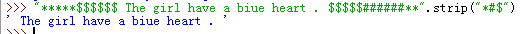
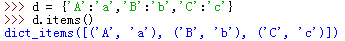

### 容器

容器大概可以分为两类：

1. 序列（列表、元组）
2. 映射（字典）
3. 集合

### 序列通用操作

- 索引
- 切片
- 序列相加: `+`
- 乘法: `*`
- 成员资格：`in`

### list

- `del`：`del list[idx]`
- append
- extend： append增强版，一次加入一段
- insert:  `list.insert(idx,value)`
- clear： `list.clear()`
- remove: `list.remove(idx)`
- pop: `list.pop(idx=-1)`,删除并返回该值
- copy
- count: `[5,6,7,5,5].count(5)`=3
- index: 查找元素，返回索引；`list.index(value)`
- reverse：翻转
- sort：从小到大排序，无返回值，`list.sort()`
- sorted:返回列表；同时输入可以为列表或字符串（可迭代对象），但返回值变为列表。`new_list=sorted(list/str)`；`sorted(iterable, cmp=None, key=None, reverse=False)`，参考：[Python sorted() 函数 | 菜鸟教程 (runoob.com)](https://www.runoob.com/python/python-func-sorted.html)
- 高级排序sort:  `list.sort(key=len,reverse=False)`，按长度排序(reverse决定正序还是反序)

### 元组

有无逗号是识别元组的关键，圆括号不那么重要？

### 字符串

- `find`: 寻找是否有某一子串，有则返回第一次第一个字符的位置，否则返回-1；
- `rfind`：返回最后一次出现第一个字符的位置；
- `join`：合并序列的字符，填充空隙；`''.join(list)`
- `lower`：改为小写字母
  - `upper`：改为大写
  - `capitalize`：第一个字母大写

- `islower()`：检查是否小写
- `replace`：替换字符串, `str.replace('old,'new')`
- `split`：`join`的反面，分割字符返回序列
- `strip`：删除开头和某位指定字符，默认为空格。

- `translate`：同时替换多个单字符

### 字典（

**成员资格：**`a in d`是指 a 是否存在于字典 d 的键中，而不是值中。而在序列中，`in` 用来查找相应的值。

注意方法名都有一个`s`结尾。

- `clear`：深删除
- `copy`：浅复制
- `get`：安全访问键，如果key不存在返回None，否则直接使用不存在的键导致错误
- `items`：dic to list
- `keys`：返回键
- `values`：返回值
- `pop`：删除某个键值对，括号内放入key
- 

参考：[Python中的容器 - 知乎 (zhihu.com)](https://zhuanlan.zhihu.com/p/41188891)