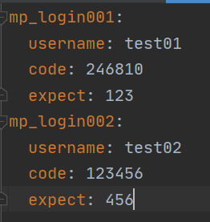

## 1. yaml文件

YAML 语言（发音 /ˈjæməl/ ）的设计目标，就是方便人类读写。它实质上是一种通用的数据串行化格式。

它的基本语法规则如下。

> - 大小写敏感
> - 使用缩进表示层级关系
> - 缩进时不允许使用Tab键，只允许使用空格。
> - 缩进的空格数目不重要，只要相同层级的元素左侧对齐即可

`#` 表示注释，从这个字符一直到行尾，都会被解析器忽略。

YAML 支持的数据结构有三种。

> - 对象：键值对的集合，又称为映射（mapping）/ 哈希（hashes） / 字典（dictionary）
> - 数组：一组按次序排列的值，又称为序列（sequence） / 列表（list）
> - 纯量（scalars）：单个的、不可再分的值

### 复合结构

对象和数组可以结合使用，形成复合结构。

> ```javascript
> languages:
>  - Ruby
>  - Perl
>  - Python 
> websites:
>  YAML: yaml.org 
>  Ruby: ruby-lang.org 
>  Python: python.org 
>  Perl: use.perl.org 
> ```

转为 JavaScript 如下。

> ```javascript
> { languages: [ 'Ruby', 'Perl', 'Python' ],
>   websites: 
>    { YAML: 'yaml.org',
>      Ruby: 'ruby-lang.org',
>      Python: 'python.org',
>      Perl: 'use.perl.org' } }
> ```

[YAML 语言教程 - 阮一峰的网络日志 (ruanyifeng.com)](https://www.ruanyifeng.com/blog/2016/07/yaml.html)


## 2. python读取yaml

首先需要下载Python的yaml库PyYAML

```python
import yaml
```

#### 1. 创建文件

输入要存储的参数，注意每个value值前面要加一个空格



#### 2. 读取

使用open方法读取出来，获取文件流，第一个参数为文件的路径

```python
f = open(file_path, 'r', encoding='utf-8').read()
```

#### 3. 转为字典

```python
f1=yaml.safe_load(f)
```

注意上面得到的是复合字典

```python
with open( 'config.yml') as f:
    config = yaml.full_load(f)
# script_name = os.path.basename(__file__).split('.')[0]
config = config[item]
cuda_id = "cuda:"+str(config['cuda_id'])
TRAIN_PATH = config['TRAIN_PATH']
```


[python参数化读取yaml文件中的内容_Zck_CSDN的博客-CSDN博客](https://blog.csdn.net/Zck_CSDN/article/details/107640967)