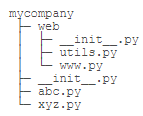

#### 目的

为了避免模块名冲突，python引入了按目录来组织模块的方法，称为package。

每一个包目录下面都会有一个\_\_init\_\_.py文件，这是包的标志文件，只有目录下有此文件才是一个python包。

\_\_init\_\_.py可以是空文件，也可以有python代码，因为\_\_init\_\_.py本身就是一个模块，模块名为目录名。 

注：模块名不要和系统模块名冲突，最好先查看系统是否已存在该模块，检查方法是在Python交互环境执行import abc，若成功则说明系统存在此模块。

\_\_init\_\_.py的内容可以为空，一般用来进行包的某些初始化工作或者设置\_\_all\_\_值，\_\_all\_\_是在`from package-name import `这语句使用的，全部导出定义过的模块。

### 作用域

在一个模块中，我们可能会定义很多函数和变量，但有的函数和变量我们希望给别人使用，有的函数和变量我们希望仅仅在模块内部使用。在Python中，是通过“_”前缀来实现的。

类似_xxx和__xxx这样的函数或变量就是非公开的（private），不应该被直接引用，比如_abc，__abc等。类似__xxx__这样的变量是特殊变量，可以被直接引用，但是有特殊用途，比如上面的__author__，__name__就是特殊变量，hello模块定义的文档注释也可以用特殊变量__doc__访问，我们自己的变量一般不要用这种变量名。

**外部不需要引用的函数全部定义成private，只有外部需要引用的函数才定义为public。**

### 模块搜索方式

python 寻找模块的优先级如下：

1、  当前文件目录

2、  环境变量PYTHONPATH

3、  sys.path(list 类型)

sys.path 是list 类型，我们可以通过insert(), append() 方法来增加模块导入的搜索路径，如：

import sys

path = “……” # 需要增加的路径

sys.path.insert(0, path)

在import模块时，该模块的顶层代码将会被执行一次。如果该模块被import多次，例如import A, import B.其中B模块本身也有import A，那么只在第一次被import的时候顶层代码会被执行。

模块能像包含函数定义一样，可包含一些可执行语句。这些可执行语句通常用来进行模块的初始化工作。这些语句只在模块第一次被导入时被执行。这非常重要，有些人以为这些语句会多次导入多次执行，其实不然。

模块在被导入执行时，python解释器为加快程序的启动速度，会在与模块文件同一目录下生成.pyc文件。我们知道python是解释性的脚本语言，而.pyc是经过编译后的字节码，这一工作会自动完成，而无需程序员手动执行。

#### 使用 from *module* import？

- 如果你要经常访问模块的属性和方法，且不想一遍又一遍地敲入模块名，使用 from *module* import。
- 如果你想要有选择地导入某些属性和方法，而不想要其它的，使用 from *module* import。
- 如果模块包含的属性和方法与你的某个模块同名，你必须使用 import *module* 来避免名字冲突。

除了这些情况，剩下的只是风格问题了，你会看到用两种方式编写的 Python 代码。

** 尽量少用 from module import * ，因为判定一个特殊的函数或属性是从哪来的有些困难，并且会造成调试和重构都更困难。

参考：

https://www.cnblogs.com/embedded-linux/p/10970855.html

https://www.cnblogs.com/ningskyer/articles/6025964.html