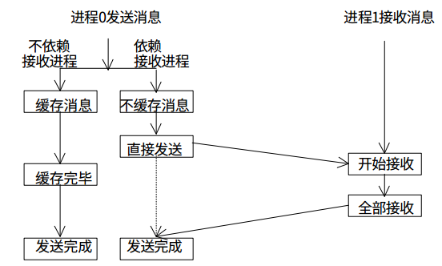
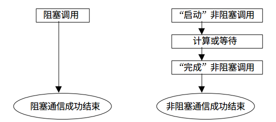
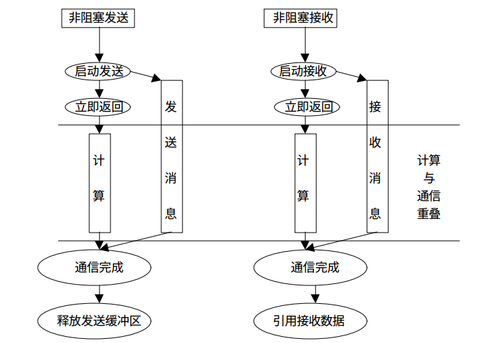

由于CPython中的GIL的存在我们可以暂时不奢望能在CPython中使用多线程利用多核资源进行并行计算了，因此我们在Python中可以利用多进程的方式充分利用多核资源。

muliprocessing 进行数据共享不太方便。

运行方式：

```shell
mpiexec -np 8 python MPI_test.py
```


## mpi4y

mpi4py是一个很强大的库，它实现了很多MPI标准中的接口，包括点对点通信，组内集合通信、非阻塞通信、重复非阻塞通信、组间通信等，基本上我能想到用到的MPI接口mpi4py中都有相应的实现。不仅是Python对象，mpi4py对numpy也有很好的支持并且传递效率很高。同时它还提供了SWIG和F2PY的接口能够让我们将自己的Fortran或者C/C++程序在封装成Python后仍然能够使用mpi4py的对象和接口来进行并行处理。可见mpi4py的作者的功力的确是非常了得。

### 环境管理

mpi4py提供了相应的接口Init()和Finalize()来初始化和结束mpi环境

但是在调用模块时会自动初始化，结束模块时会调用finialize，无需显示调用

### 通信域

两个预定义的通信域对象:

1. 包含所有进程的COMM_WORLD
2. 只包含调用进程本身的COMM_SELF

通信域对象则提供了与通信域相关的接口，例如获取当前进程号、获取通信域内的进程数、获取进程组、对进程组进行集合运算、分割合并等等


### 点对点通信

两个不同的进程之间可以通过点对点通讯交换数据：一个进程是接收者，一个进程是发送者。

传递numpy数组地效率接近于C

而传递python对象则需要接口：send(), recv(), isend()



### 集体通信（广播通信）

bcast：集体交流，将相同的数据发送给所有在监听的进程

scatter：将数据放在数组中，发送给不同的进程

gather：搜集所有进程发送向root进程的数据

```python
from mpi4py import MPI
comm = MPI.COMM_WORLD
size = comm.Get_size()
rank = comm.Get_rank()
data = (rank+1)**2
data = comm.gather(data, root=0)
if rank == 0:
    print ("rank = %s " %rank + "...receiving data to other process")
    for i in range(1, size):
        data[i] = (i+1)**2
        value = data[i]
        print(" process %s receiving %s from process %s" % (rank , value , i))
```


### 阻塞与非阻塞通信






### numpy数组的支持

来个阻塞标准通信的例子：

```python
from mpi4py import MPI                                                 
import numpy as np                                                     
                                                                       
comm = MPI.COMM_WORLD                                                  
rank = comm.Get_rank()                                                 
size = comm.Get_size()                                                 
                                                                       
if rank == 0:                                                          
    data = np.arange(10, dtype='i')                                    
    comm.Send([data, MPI.INT], dest=1, tag=11)                         
    print("process {} Send buffer-like array {}...".format(rank, data))
else:                                                                  
    data = np.empty(10, dtype='i')                                     
    comm.Recv([data, MPI.INT], source=0, tag=11)                       
    print("process {} recv buffer-like array {}...".format(rank, data))
```


参考：[Python多进程并行编程实践-mpi4py的使用 - 知乎 (zhihu.com)](https://zhuanlan.zhihu.com/p/25332041)

[Python并行编程 中文版 — python-parallel-programming-cookbook-cn 1.0 文档 (phpweek.com)](https://www.phpweek.com/python-parallel-programming/index.html)