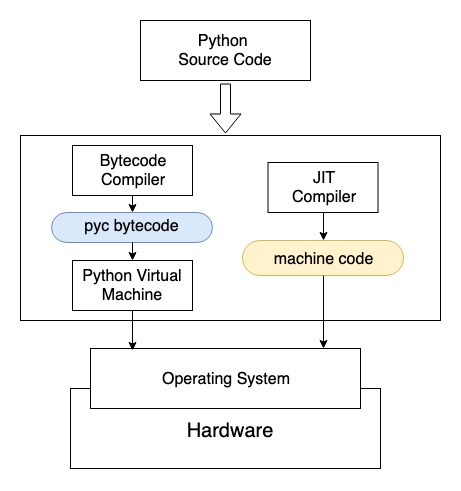

Just-In-Time（JIT）技术为解释语言提供了一种优化，它能克服上述效率问题，极大提升代码执行速度，同时保留Python语言的易用性。使用JIT技术时，JIT编译器将Python源代码编译成机器直接可以执行的机器语言，并可以直接在CPU等硬件上运行。这样就跳过了原来的虚拟机，执行速度几乎与用C语言编程速度并无二致。

### Numba

Just-In-Time（JIT）技术为解释语言提供了一种优化，它能克服上述效率问题，极大提升代码执行速度，同时保留Python语言的易用性。使用JIT技术时，JIT编译器将Python源代码编译成机器直接可以执行的机器语言，并可以直接在CPU等硬件上运行。这样就跳过了原来的虚拟机，执行速度几乎与用C语言编程速度并无二致。

```python
from numba import jit
import numpy as np

SIZE = 2000
x = np.random.random((SIZE, SIZE))

"""
给定n*n矩阵，对矩阵每个元素计算tanh值，然后求和。
因为要循环矩阵中的每个元素，计算复杂度为 n*n。
"""
@jit
def jit_tan_sum(a):   # 函数在被调用时编译成机器语言
    tan_sum = 0
    for i in range(SIZE):   # Numba 支持循环
        for j in range(SIZE):
            tan_sum += np.tanh(a[i, j])   # Numba 支持绝大多数NumPy函数
    return tan_sum

print(jit_tan_sum(x))
```

### 缺点

目前Numba只支持了Python原生函数和部分NumPy函数，其他一些场景可能不适用。

```python
from numba import jit
import pandas as pd

x = {'a': [1, 2, 3], 'b': [20, 30, 40]}

@jit
def use_pandas(a): # Numba对这个函数支持不好
    df = pd.DataFrame.from_dict(a) # Numba 不知道 pd.DataFrame 在做什么
    df += 1                        # Numba 也无法优化这个操作
    return df.cov()                

print(use_pandas(x))
```

pandas是更高层次的封装，Numba其实不能理解它里面做了什么，所以无法对其加速

一些大家经常用的机器学习框架，如`scikit-learn`，`tensorflow`，`pytorch`等，已经做了大量的优化，不适合再使用Numba做加速。

此外，Numba不支持：

- `try...except` 异常处理
- `with` 语句
- 类定义`class`
- `yield from`

#### nopython模式

Numba真正牛逼之处在于其`nopython`模式。将装饰器改为`@jit(nopython=True)`或者`@njit`，Numba会假设你已经对所加速的函数非常了解，强制使用加速的方式，不会进入`object`模式，如编译不成功，则直接抛出异常。`nopython`的名字会有点歧义，我们可以理解为不使用很慢的Python，强制进入*图 Python解释器工作原理*中右侧部分。

实践上，一般推荐将代码中计算密集的部分作为单独的函数提出来，并使用`nopython`方式优化，这样可以保证我们能使用到Numba的加速功能。其余部分还是使用Python原生代码，在计算加速的前提下，避免过长的编译时间。Numba可以与NumPy紧密结合，两者一起，常常能够得到近乎C语言的速度。尽管Numba不能直接优化pandas，但是我们可以将pandas中处理数据的`for`循环作为单独的函数提出来，再使用Numba加速。


#### 编译开销

编译源代码需要一定的时间。C/C++等编译型语言要提前把整个程序先编译好，再执行可执行文件。Numba库提供的是一种懒编译（Lazy Compilation）技术，即在运行过程中第一次发现代码中有`@jit`，才将该代码块编译。用到的时候才编译，看起来比较懒，所以叫懒编译。使用Numba时，总时间 = 编译时间 + 运行时间。相比所能节省的计算时间，编译的时间开销很小，所以物有所值。对于一个需要多次调用的Numba函数，只需要编译一次，后面再调用时就不需要编译了。

```python
from numba import jit
import numpy as np
import time

SIZE = 2000
x = np.random.random((SIZE, SIZE))

"""
给定n*n矩阵，对矩阵每个元素计算tanh值，然后求和。
因为要循环矩阵中的每个元素，计算复杂度为 n*n。
"""
@jit
def jit_tan_sum(a):   # 函数在被调用时编译成机器语言
    tan_sum = 0
    for i in range(SIZE):   # Numba 支持循环
        for j in range(SIZE):
            tan_sum += np.tanh(a[i, j])   # Numba 支持绝大多数NumPy函数
    return tan_sum

# 总时间 = 编译时间 + 运行时间
start = time.time()
jit_tan_sum(x)
end = time.time()
print("Elapsed (with compilation) = %s" % (end - start))

# Numba将加速的代码缓存下来
# 总时间 = 运行时间
start = time.time()
jit_tan_sum(x)
end = time.time()
print("Elapsed (after compilation) = %s" % (end - start))
```

> Elapsed (with compilation) = 0.49199914932250977
> Elapsed (after compilation) = 0.0364077091217041


#### 类型指定

Numba给出了名为Eager Compilation的优化方式。

```python
from numba import jit, int32

@jit("int32(int32, int32)", nopython=True)
def f2(x, y):
    return x + y
```


`@jit(int32(int32, int32))`告知Numba你的函数在使用什么样的输入和输出，括号内是输入，括号左侧是输出。这样不会加快执行速度，但是会加快编译速度，可以更快将函数编译到机器码上。


#### 向量化

`@vectorize`装饰器可以将一个函数向量化，变成类似NumPy函数一样，直接处理矩阵和张量。

#### 加速原理


参考：[Numba简介 | 鲁老师技术分享 (lulaoshi.info)](https://lulaoshi.info/gpu/python-cuda/numba)

