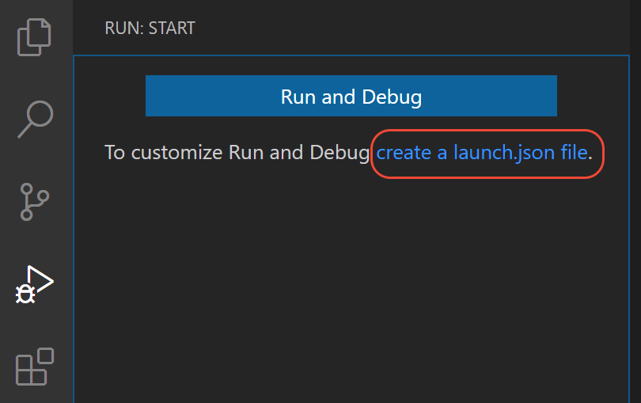

## 在vscode中

### 1.1 常用的

在vscode右边打开debug窗口，如果没有配置文件，先新建；

一般使用python file current active python file

**Note** Starting a debugging session through the Debug Panel, **F5** or **Run > Start Debugging**, when no configuration exists will also bring up the debug configuration menu, but will not create a launch.json file.

#### 1.2 通过网络debug

参考：

https://code.visualstudio.com/docs/python/debugging