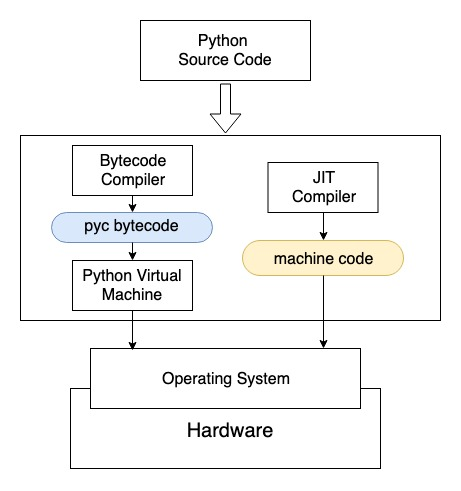
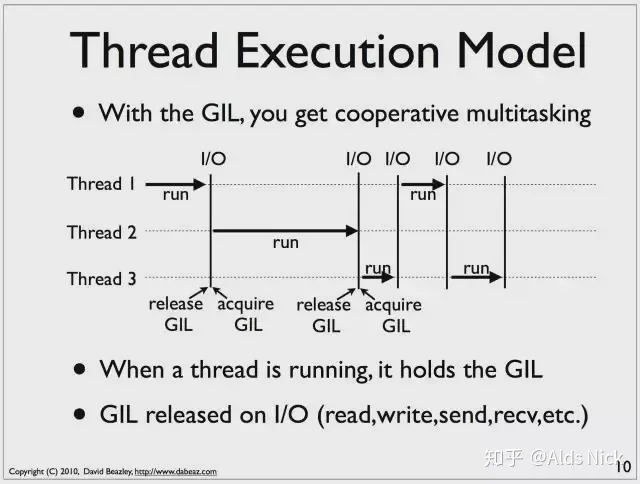
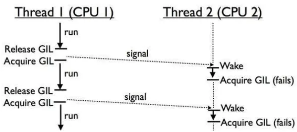

### 不同类型的python解释器

python是一种编程语言，其实现（解释器）有很多种。

其中使用[c语言开发](https://www.baidu.com/s?wd=c语言开发&tn=SE_PcZhidaonwhc_ngpagmjz&rsv_dl=gh_pc_zhidao)的叫做python，在与别的语言开发的python对比时为避免歧义通常称为CPython。

同样的，使用[java开发](https://www.baidu.com/s?wd=java开发&tn=SE_PcZhidaonwhc_ngpagmjz&rsv_dl=gh_pc_zhidao)的叫做JPython，使用.net开发的叫做IronPython。

#### 对比

CPython：是用C语言实现Pyhon，是目前应用最广泛的解释器。最新的语言特性都是在这个上面先实现，基本包含了所有第三方库支持，但是CPython有几个缺陷，一是(GIL)全局锁使Python在多线程效能上表现不佳，二是CPython无法支持JIT（即时编译），导致其执行速度不及Java和Javascipt等语言。于是出现了Pypy。
Pypy：是用Python自身实现的解释器。针对CPython的缺点进行了各方面的改良，性能得到很大的提升。最重要的一点就是Pypy集成了JIT。但是，Pypy无法支持官方的C/Python API，导致无法使用例如Numpy，Scipy等重要的第三方库。这也是现在Pypy没有被广泛使用的原因吧。

**后面默认指Cpython**。

### python编译

我们使用`python example.py`来执行一份源代码时，Python解释器会在后台启动一个字节码编译器（Bytecode Compiler），将源代码转换为字节码。字节码是一种只能运行在虚拟机上的文件，Python的字节码默认后缀为`.pyc`，Python生成`.pyc`后一般放在内存中继续使用，并不是每次都将`.pyc`文件保存到磁盘上。有时候我们会看到自己Python代码文件夹里有很多`.pyc`文件与`.py`文件同名，但也有很多时候看不到`.pyc`文件。pyc字节码通过Python虚拟机与硬件交互。虚拟机的出现导致程序和硬件之间增加了中间层，运行效率大打折扣。

### 全局锁

GIL(Global Interpreter Lock, 全局解释锁)。

现代操作系统让一个进程可以启动多个线程来执行系统指令，导致CPU资源紧张，负载会均匀平摊到各个CPU核心。

**多线程的进程中，当你更改内存中的变量，你需要确认多个线程不会同时尝试访问或修改同一个内存块。**

当CPython创建变量，它会给变量分配内存空间并且计算变量的引用数，如果引用数为0, Python将会释放掉这块内存，这就是为什么for循环表达式里的临时变量不会让内存爆炸。也是CPython的垃圾回收机制。

接下来的挑战是，当变量被多个线程共享时，如何锁住引用数。Python程序执行过程中有一个全局解释锁GIL 小心地控制着线程的执行。Python解释器在同一时间只能执行一个操作，不论有多少个线程。

在单核上：在一个古老的单核CPU上调度多个线程任务，大家相互共享一个全局锁，谁在CPU执行，谁就占有这把锁，直到这个线程因为IO操作或者Timer Tick到期让出CPU，没有在执行的线程就安静的等待着这把锁（除了等待之外，他们应该也无事可做）

在多核上：

古老GIL机制，如果线程2需要在CPU 2 上执行，它需要先等待在CPU 1 上执行的线程1释放GIL（记住：GIL是全局的）。如果线程1是因为 i/o 阻塞让出的GIL，那么线程2必定拿到Gil。但如果线程1是因为timer ticks计数满100让出GIL，那么这个时候线程1和线程2公平竞争。但要命的是，在Python 2.x, 线程1不会动态的调整自身的优先级，所以很大概率下次被选中执行的还是线程1，在很多个这样的选举周期内，线程2只能安静的看着线程1拿着GIL在CPU 1上欢快的执行。

如果你使用一个web应用(Django)并且使用WSGI，每个请求会有一个单独的Python解释器，由于Python的全局解释锁启动很慢，所以有的WSGI实现会有一个“守护模式”，就是先把Python进程启动起来放着，等待请求进来使用。

**如何避免GIL的影响**

有两个建议：

1. 在以IO操作为主的IO密集型应用中，多线程和多进程的性能区别并不大，原因在于即使在Python中有GIL锁的存在，由于线程中的IO操作会使得线程立即释放GIL，切换到其他非IO线程继续操作，提高程序执行效率。相比进程操作，线程操作更加轻量级，线程之间的通讯复杂度更低，建议使用多线程。

2. 如果是计算密集型的应用，尽量使用多进程或者协程来代替多线程。

### 其他python实现

PyPy也有GIL但是比CPython快超过三倍。 JPython 没有GIL, 因为JPython的线程代表一个Java线程，得益于JVM的内存管理机制，JPython不使用GIL。

### JIT

一个好的JIT编译器应用的那一部分被执行很多次，这些部分被称为“热点”。 这样编译器会将这些部分替换成更加高效的版本。这意味着如果你的程序重复做相同的事情，使用JIT就能显著提高速度。同时Java/C#是强类型的语言所以优化器可以对语言作出更多预设。

### 所以为什么CPython不用JIT呢

JIT有很多缺点，其中一个就是启动慢。

CPython 启动已经相对很慢了, PyPy比CPython启动慢CPython2-3倍。JVM启动是出了名的慢。.NET CLR使用随操作系统启动来解决这个问题, 但CLR的开发者同时也是其依赖的系统的开发者(win)。

如果你的Python是单进程，运行时间很长，并且有很多重复操作可以被优化，那么使用JIT就很有意义。 但是CPython是通用实现，当使用Python开发命令行工具，每次都等待JIT启动是非常糟糕的体验。 CPython需要服务于尽可能广泛的场景，有可能使用JIT反而会大幅度拖累系统性能。 如果你需要使用JIT并且有一个适合的工作场景，那可以使用PyPy。

### 结论

Python这么慢主要是因为动态的生态和它的多功能性。它能用来解决所有类型的问题，所以在不同领域我们可以选择更加快速的Python版本。
有很多方法可以用来优化你的Python程序，比如活用async, 了解分析工具, 考虑使用多个解释器等等。比如一些启动时间不重要的应用，或者能够能JIT获益的程序我们可以使用PyPy。如果你的代码有些部分非常要求性能，又使用了很多C语言的静态类型，那么选择Cpython。

原文链接：https://blog.csdn.net/fu6543210/article/details/90770794

参考：[Numba简介 | 鲁老师技术分享 (lulaoshi.info)](https://lulaoshi.info/gpu/python-cuda/numba)

[为什么Python 如此之慢 - 知乎 (zhihu.com)](https://zhuanlan.zhihu.com/p/67630796)

[CPython是什么？PyPy是什么？Python和这两个东西有什么关系_furuit的博客-CSDN博客_cpython和python](https://blog.csdn.net/fu6543210/article/details/90770794)