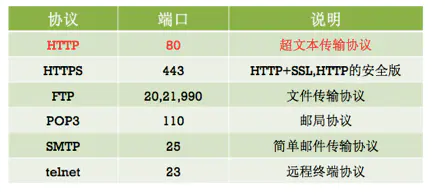
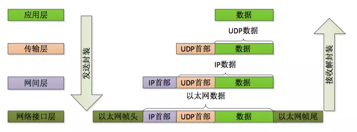

## OSI七层理想模型

#### 各层设备
- 物理层：
物理层负责最后将信息编码成电流脉冲或其它信号用于网上传输；
eg：RJ45等将数据转化成0和1；
- 数据链路层:
数据链路层通过物理网络链路􏰁供数据传输。不同的数据链路层定义了不同的网络和协 议特征,其中包括物理编址、网络拓扑结构、错误校验、数据帧序列以及流控;
可以简单的理解为：规定了0和1的分包形式，确定了网络数据包的形式；
- 网络层
网络层负责在源和终点之间建立连接;
可以理解为，此处需要确定计算机的位置，怎么确定？IPv4，IPv6！
- 传输层
传输层向高层􏰁提供可靠的端到端的网络数据流服务。
可以理解为：每一个应用程序都会在网卡注册一个端口号，该层就是端口与端口的通信！常用的（TCP／IP）协议；
- 会话层
会话层建立、管理和终止表示层与实体之间的通信会话；
建立一个连接（自动的手机信息、自动的网络寻址）;
- 表示层:
表示层􏰁供多种功能用于应用层数据编码和转化,以确保以一个系统应用层发送的信息 可以被另一个系统应用层识别;
可以理解为：解决不同系统之间的通信，eg：Linux下的QQ和Windows下的QQ可以通信；
- 应用层:
OSI 的应用层协议包括文件的传输、访问及管理协议(FTAM) ,以及文件虚拟终端协议(VIP)和公用管理系统信息(CMIP)等;
规定数据的传输协议；

常见的应用层协议：

## TCP/IP四层参考模型
  ┌────------────┐┌─┬─┬─-┬─┬─-┬─┬─-┬─┬─-┬─┬─-┐
　　│　　　　　　　　││Ｄ│Ｆ│Ｗ│Ｆ│Ｈ│Ｇ│Ｔ│Ｉ│Ｓ│Ｕ│　│
　　│　　　　　　　　││Ｎ│Ｉ│Ｈ│Ｔ│Ｔ│Ｏ│Ｅ│Ｒ│Ｍ│Ｓ│其│
　　│第四层，应用层　││Ｓ│Ｎ│Ｏ│Ｐ│Ｔ│Ｐ│Ｌ│Ｃ│Ｔ│Ｅ│　│
　　│　　　　　　　　││　│Ｇ│Ｉ│　│Ｐ│Ｈ│Ｎ│　│Ｐ│Ｎ│　│
　　│　　　　　　　　││　│Ｅ│Ｓ│　│　│Ｅ│Ｅ│　│　│Ｅ│它│
　　│　　　　　　　　││　│Ｒ│　│　│　│Ｒ│Ｔ│　│　│Ｔ│　│
　　└───────------─┘└─┴─┴─-┴─┴─-┴─┴─-┴─┴─-┴─┴-─┘
　　┌───────-----─┐┌─────────-------┬──--------─────────┐
　　│第三层，传输层　││　　　ＴＣＰ　　　│　　　　ＵＤＰ　　　　│
　　└───────-----─┘└────────-------─┴──────────--------─┘
　　┌───────-----─┐┌───----──┬───---─┬────────-------──┐
　　│　　　　　　　　││　　　　　│ＩＣＭＰ│　　　　　　　　　　│
　　│第二层，网间层　││　　　　　└──---──┘　　　　　　　　　　│
　　│　　　　　　　　││　　　　　　　ＩＰ　　　　　　　　　　　 │
　　└────────-----┘└────────────────────-------------─-┘
　　┌────────-----┐┌─────────-------┬──────--------─────┐
　　│第一层，网络接口││ＡＲＰ／ＲＡＲＰ　│　　　　其它　　　　　│
　　└────────------┘└─────────------┴─────--------──────┘

数据包
宽泛意义的数据包:每一个数据包都包含"标头"和"数据"两个部分."标头"包含本数据包的一些说明."数据"则是本数据包的内容.

细分数据包：

应用程序数据包: 标头部分规定应用程序的数据格式.数据部分传输具体的数据内容.*** ——对应上图中的数据！***

TCP/UDP数据包:标头部分包含双方的发出端口和接收端口. UDP数据包:'标头'长度:8个字节,"数据包"总长度最大为65535字节,正好放进一个IP数据包. TCP数据包:理论上没有长度限制,但是,为了保证网络传输效率,通常不会超过IP数据长度,确保单个包不会被分割. *** ——对应上图中的UDP数据！***

IP数据包: 标头部分包含通信双方的IP地址,协议版本,长度等信息. '标头'长度:20~60字节,"数据包"总长度最大为65535字节. *** ——对应上图中的IP数据***

以太网数据包: 最基础的数据包.标头部分包含了通信双方的MAC地址,数据类型等. '标头'长度:18字节,'数据'部分长度:46~1500字节. *** ——对应上图中的以太网数据***

### TCP/IP 协议族常用协议

- 应用层：TFTP，HTTP，SNMP，FTP，SMTP，DNS，Telnet 等等
- 传输层：TCP，UDP
- 网络层：IP，ICMP，OSPF，EIGRP，IGMP
- 数据链路层：SLIP，CSLIP，PPP，MTU
重要的 TCP/IP 协议族协议进行简单介绍:

IP(Internet Protocol,网际协议)是网间层的主要协议,任务是在源地址和和目的地址之间传输数据。IP 协议只是尽最大努力来传输数据包,并不保证所有的包都可以传输 到目的地,也不保证数据包的顺序和唯一。

IP 定义了 TCP/IP 的地址,寻址方法,以及路由规则。现在广泛使用的 IP 协议有 IPv4 和 IPv6 两种:IPv4 使用 32 位二进制整数做地址,一般使用点分十进制方式表示,比如 192.168.0.1。
IP 地址由两部分组成,即网络号和主机号。故一个完整的 IPv4 地址往往表示 为 192.168.0.1/24 或192.168.0.1/255.255.255.0 这种形式。
IPv6 是为了解决 IPv4 地址耗尽和其它一些问题而研发的最新版本的 IP。使用 128 位 整数表示地址,通常使用冒号分隔的十六进制来表示,并且可以省略其中一串连续的 0,如:fe80::200:1ff:fe00:1。
目前使用并不多！
ICMP(Internet Control Message Protocol,网络控制消息协议)是 TCP/IP 的 核心协议之一,用于在 IP 网络中发送控制消息,􏰁供通信过程中的各种问题反馈。 ICMP 直接使用 IP 数据包传输,但 ICMP 并不被视为 IP 协议的子协议。常见的联网状态诊断工具比如依赖于 ICMP 协议;

TCP(TransmissionControlProtocol,传输控制协议)是一种面向连接的,可靠的, 基于字节流传输的通信协议。TCP 具有端口号的概念,用来标识同一个地址上的不 同应用。􏰂述 TCP 的标准文档是 RFC793。

UDP(UserDatagramProtocol,用户数据报协议)是一个面向数据报的传输层协 议。UDP 的传输是不可靠的,简单的说就是发了不管,发送者不会知道目标地址 的数据通路是否发生拥塞,也不知道数据是否到达,是否完整以及是否还是原来的 次序。它同 TCP 一样有用来标识本地应用的端口号。所以应用 UDP 的应用,都能 够容忍一定数量的错误和丢包,但是对传输性能敏感的,比如流媒体、DNS 等。

ECHO(EchoProtocol,回声协议)是一个简单的调试和检测工具。服务器器会 原样回发它收到的任何数据,既可以使用 TCP 传输,也可以使用 UDP 传输。使用 端口号 7 。

DHCP(DynamicHostConfigrationProtocol,动态主机配置协议)是用于局域 网自动分配 IP 地址和主机配置的协议。可以使局域网的部署更加简单。

DNS(DomainNameSystem,域名系统)是互联网的一项服务,可以简单的将用“.” 分隔的一般会有意义的域名转换成不易记忆的 IP 地址。一般使用 UDP 协议传输, 也可以使用 TCP,默认服务端口号 53。􏰂

FTP(FileTransferProtocol,文件传输协议)是用来进行文件传输的标准协议。 FTP 基于 TCP 使用端口号 20 来传输数据,21 来传输控制信息。

TFTP(Trivial File Transfer Protocol,简单文件传输协议)是一个简化的文 件传输协议,其设计非常简单,通过少量存储器就能轻松实现,所以一般被用来通 过网络引导计算机过程中传输引导文件等小文件;

SSH(SecureShell,安全Shell),因为传统的网络服务程序比如TELNET本质上都极不安全,明文传说数据和用户信息包括密码,SSH 被开发出来避免这些问题, 它其实是一个协议框架,有大量的扩展冗余能力,并且􏰁供了加密压缩的通道可以 为其他协议使用。

POP(PostOfficeProtocol,邮局协议)是支持通过客户端访问电子邮件的服务, 现在版本是 POP3,也有加密的版本 POP3S。协议使用 TCP,端口 110。

SMTP(Simple Mail Transfer Protocol,简单邮件传输协议)是现在在互联网 上发送电子邮件的事实标准。使用 TCP 协议传输,端口号 25。

HTTP(HyperTextTransferProtocol,超文本传输协议)是现在广为流行的WEB 网络的基础,HTTPS 是 HTTP 的加密安全版本。协议通过 TCP 传输,HTTP 默认 使用端口 80,HTTPS 使用 443。

