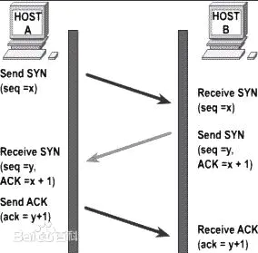
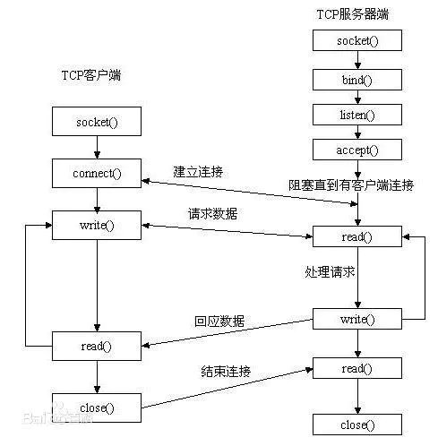

#### 1. 基本区别

TCP与UDP基本区别：  
1. 基于连接与无连接
2. TCP要求系统资源较多，UDP较少； 
3. UDP程序结构较简单 
4. 流模式（TCP）与数据报模式(UDP); 
5. TCP保证数据正确性，UDP可能丢包 
6. TCP保证数据顺序，UDP不保证 

#### 2. 编程区别
1. socket()的参数不同 
2. UDP Server不需要调用listen和accept 
3. UDP收发数据用sendto/recvfrom函数 
4. TCP：地址信息在connect/accept时确定 
5. UDP：在sendto/recvfrom函数中每次均 需指定地址信息 
6. UDP：shutdown函数无效

#### 其他
1. 通常网络编程指TCP编程，即用socket函数创建一个socket用于TCP通讯，这个函数为sockett(PF_INET, SOCK_STREAM, 0)，特点是：面向连接，每次收发数据前需要通过connect建立连接；任何一方都可以收发数据。
2. 而SOCK_DGRAM这种是User Datagram Protocol协议的网络通讯，它是无连接的，不可靠的，因为通讯双方发送数据后不知道对方是否已经收到数据，是否正常收到数据。任何一方建立一个socket以后就可以用sendto发送数据，也可以用recvfrom接收数据。根本不关心对方是否存在，是否发送了数据。它的特点是通讯速度比较快。大家都知道TCP是要经过三次握手的，而UDP没有。

## TCP
#### 面向字节流
面向字节流的话，虽然应用程序和TCP的交互是一次一个数据块（大小不等），但TCP把应用程序看成是一连串的无结构的字节流。TCP有一个缓冲，当应用程序传送的数据块太长，TCP就可以把它划分短一些再传送。如果应用程序一次只发送一个字节，TCP也可以等待积累有足够多的字节后再构成报文段发送出去。

#### 工作原理
TCP的连接建立过程又称为TCP三次握手;
- 首先发送方主机向接收方主机发起一个建立连接的同步（SYN）请求；
- 接收方主机在收到这个请求后向发送方主机回复一个同步/确认（SYN/ACK）应答；
- 发送方主机收到此包后再向接收方主机发送一个确认（ACK），此时TCP连接成功建立.
一旦初始的三次握手完成，在发送和接收主机之间将按顺序发送和确认段。关闭连接之前，TCP使用类似的握手过程验证两个主机是否都完成发送和接收全部数据。
完成三次握手，客户端与服务器开始传送数据。

三次握手示意图：

#### 编程步骤
TCP编程的服务器端一般步骤是： 
　　1、创建一个socket，用函数socket()； 
　　2、设置socket属性，用函数setsockopt();  可选 
　　3、绑定IP地址、端口等信息到socket上，用函数bind(); 
　　4、开启监听，用函数listen()； 
　　5、接收客户端上来的连接，用函数accept()； 
　　6、收发数据，用函数send()和recv()，或者read()和write(); 
　　7、关闭网络连接； 
　　8、关闭监听； 

TCP编程的客户端一般步骤是： 
　　1、创建一个socket，用函数socket()； 
　　2、设置socket属性，用函数setsockopt(); 可选 
　　3、绑定IP地址、端口等信息到socket上，用函数bind();可选 
　　4、设置要连接的对方的IP地址和端口等属性； 
　　5、连接服务器，用函数connect()； 
　　6、收发数据，用函数send()和recv()，或者read()和write(); 
　　7、关闭网络连接；

## UDP
在有些情况下UDP可能会变得非常有用。因为UDP具有TCP所望尘莫及的速度优势。虽然TCP中植入了各种安全保障功能，但是在实际执行的过程中会占用大量的系统开销，无疑使速度受到严重的影响。反观UDP由于排除了信息可靠传递机制，将安全和排序等功能移交给上层应用来完成，极大地降低了执行时间，使速度得到了保证。

#### 面向报文
UDP对应用层交下来的报文，既不合并，也不拆分，而是保留这些报文的边界。这也就是说，应用层交给UDP多长的报文，UDP就照样发送，即一次发送一个报文。
#### 编程步骤
UDP编程的服务器端一般步骤是： 
　　1、创建一个socket，用函数socket()； 
　　2、设置socket属性，用函数setsockopt(); 可选 
　　3、绑定IP地址、端口等信息到socket上，用函数bind(); 
　　4、循环接收数据，用函数recvfrom(); 
　　5、关闭网络连接； 

UDP编程的客户端一般步骤是： 
　　1、创建一个socket，用函数socket()； 
　　2、设置socket属性，用函数setsockopt(); 可选 
　　3、绑定IP地址、端口等信息到socket上，用函数bind(); 可选 
　　4、设置对方的IP地址和端口等属性; 
　　5、发送数据，用函数sendto(); 
　　6、关闭网络连接；

#### 应用场景

1. 面向数据报方式
2. 网络数据大多为短消息 
3. 拥有大量Client
4. 对数据安全性无特殊要求
5. 网络负担非常重，但对响应速度要求高

