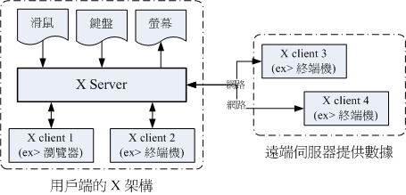

### 1. 主要部件

可以分为服务器于客户端

**X Server** 的重点就是在管理用户端的硬件，包括接受键盘/鼠标等设备的输入资讯， 并且将图形绘制到萤幕上 (请注意上图的所有组件之间的箭头指示)

**X Client** (就是 X 应用程序) 主要提供的就是告知 X Server 要绘制啥东西。那照这样的想法来思考，我们是想要取得远程服务器的绘图数据来我们的计算机上面显示嘛！ 所以罗，远程服务器提供的是 X client 软件啊！

#### 1.2. X server 

 Linux 的配置与 X Server 的配置不一定要相同的！因此，你在 Linux 的 run level 3 想要玩图形介面时，就得要加载 X Window 需要的驱动程序才行～总之， X Server 的主要功能就是在管理『主机』上面的显示硬件与驱动程序。

X Server 的目的在管理用户端的硬件设备！也就是说：『每部用户端主机都需要安装 X Server，而服务器端则是提供 X Client 软件， 以提供用户端绘图所需要的数据数据』。

#### 1. 3. X Clients

前面提到的 X Server 主要是管理显示介面与在萤幕上绘图，同时将输入装置的行为告知 X Client， 此时 X Client 就会依据这个输入装置的行为来开始处理，最后 X Client 会得到『 嗯！这个输入装置的行为会产生某个图示』，然后将这个图示的显示数据回传给 X Server ， X server 再根据 X Client 传来的绘图数据将他描图在自己的萤幕上，来得到显示的结果。

也就是说， X Client 最重要的工作就是处理来自 X Server 的动作，将该动作处理成为绘图数据， 再将这些绘图数据传回给 X Server

举个例子来说，当我们在 X Window 的画面中，将鼠标向右移动，那他是怎么告知 X Server 与 X Client 的呢？ 首先， X server 会侦测到鼠标的移动，但是他不知道应该怎么绘图啊！此时，他将鼠标的这个动作告知 X Client， X Client 就会去运算，结果得到，嘿嘿！其实要将鼠标指标向右移动几个位素，然后将这个结果告知 X server ， 接下来，您就会看到 X Server 将鼠标指标向右移动

#### 1. 4. X Windos Manager

**特殊的 X Client ，负责管理所有的 X client 软件**

- 提供许多的控制元素，包括工作列、背景壁纸的配置等等；
- 管理虚拟壁纸 (virtual desktop)；
- 提供窗口控制参数，这包括窗口的大小、窗口的重叠显示、窗口的移动、窗口的最小化等等。

我们常常听到的 KDE, GNOME, XFCE 还有簡易到爆的 twm 等等，都是一些窗口管理员的专案计画啦

参考：http://cn.linux.vbird.org/linux_basic/0590xwindow.php