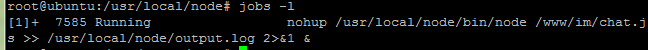

## 1. 建立后台程序

nohup+&

```shell
nohup /usr/local/node/bin/node /www/im/chat.js >> /usr/local/node/output.log 2>&1 &
```

## 2. 查看并关闭后台程序

### 1. jobs

**只对打开后台程序的那个终端有效**



### 2. ps

```shell
ps -aux|grep chat.js
```

如果某个进程起不来，可能是某个端口被占用

查看使用某端口的进程

```shell
lsof -i:8090
```

终止后台运行的进程

```shell
kill -9 进程号
```

