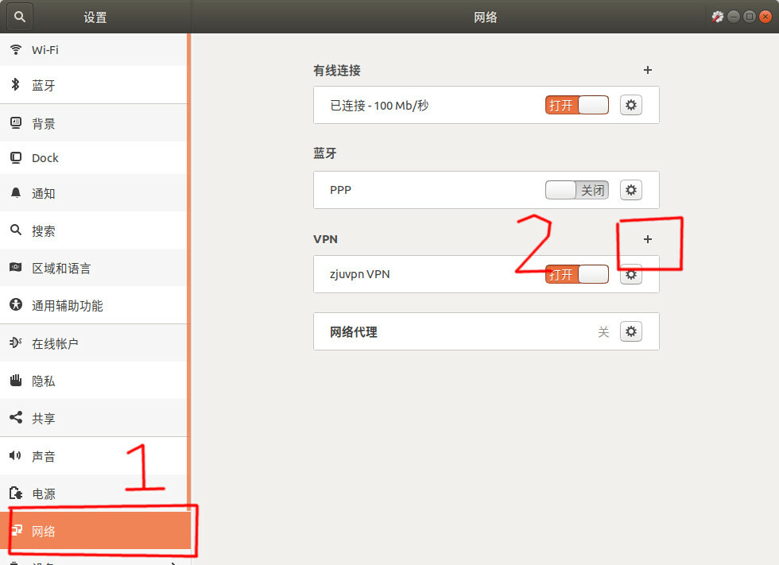
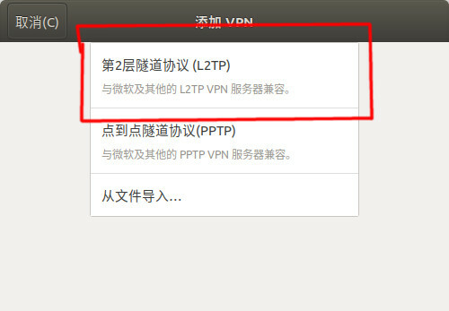
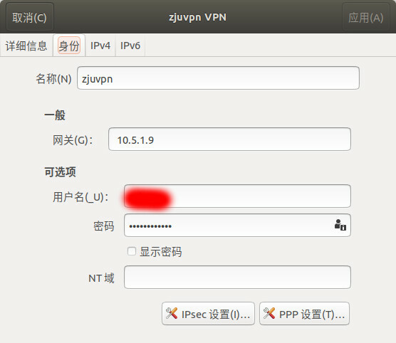
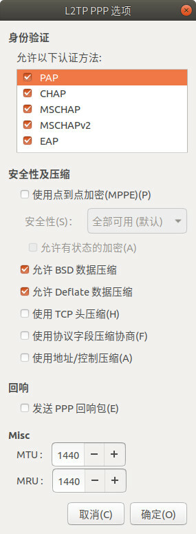
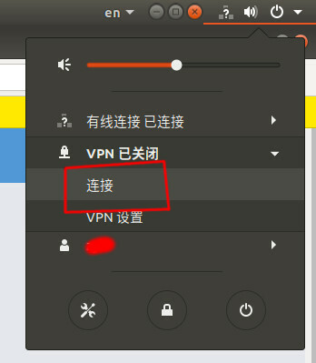

#### 问题

如何在ubuntu18及更高版本上自建l2tp的vpn

### 图形界面

**ubuntu 18.04**已经可以通过**自带的图形界面**连接校内的vpn了，不再需要命令行，deb包，root权限。方法如下： 1. 安装network-manager-l2tp、network-manager-l2tp-gnome 2. 按照如下图所示配置












\3. 连接就可以使用了



参考：[2019年ubuntu图形界面连接vpn，不再需要命令行 - CC98论坛](https://www.cc98.org/topic/4848071)

### 命令行

先安装network manager和l2tp插件,并创建一个连接，应该会在`/etc/NetworkManager/system-connections`目录下生成一个名为`vpn- {你的vpn名称}-nmconnection`的文件

```
sudo apt install network-manager network-manager-l2tp network-manager-l2tp-gnome
sudo nmcli connection add type vpn ifname {你的vpn名称} vpn-type l2tp 
```

然后根据desktop上的配置文件修改 `/etc/NetworkManager/system-connections`下的文件,给一个我的参考，只需要把[vpn]部分修改一下，并添加一下新的[vpn-secrets]

```
# /etc/NetworkManager/system-connections/vpn-ZJU3.nmconnection
[connection]
id=vpn-ZJU3   
uuid=df8c8c2a-aa86-4695-9909-42cddeddad15 
type=vpn
interface-name=ZJU3
permissions=

[vpn]
gateway=10.5.1.9
mru=1440
mtu=1440
no-vj-comp=yes
noaccomp=yes
nopcomp=yes
password-flags=0
user=                   # 你的学号
service-type=org.freedesktop.NetworkManager.l2tp

[vpn-secrets]
password=            # 你的密码

[ipv4]
dns-search=
method=auto

[ipv6]
addr-gen-mode=stable-privacy
dns-search=
method=auto

[proxy]
```

然后重新加载配置,并连接即可

```
sudo nmcli connection reload
sudo nmcli connection up {你的vpn名称}
```

如果连接不了，确保/etc/netplan/01-…文件里有以下内容，然后重启

```
network:
  version: 2
  renderer: NetworkManager
```

参考：[network-manager命令行如何自建vpn - CC98论坛](https://www.cc98.org/topic/5138159)

#### 可能的bug

我的出现了启动网络失败的情形，后来根据图形界面的设置，发现直接在文件里输入密码无法启动，需要后期自己输入。我的文件为：

```
[connection]
id=my-vpn
uuid=10c7ccce-b660-4f20-b66e-a7b9fed4995f
type=vpn
autoconnect=false
permissions=

[vpn]
gateway=10.5.1.9
mru=1440
mtu=1440
no-vj-comp=yes
noaccomp=yes
nopcomp=yes
password-flags=2
user=xxxxxx
service-type=org.freedesktop.NetworkManager.l2tp

[ipv4]
dns-search=
method=auto

[ipv6]
addr-gen-mode=stable-privacy
dns-search=
method=auto

[proxy]
```


图形化和命令行两种方法本质上是一样的。

