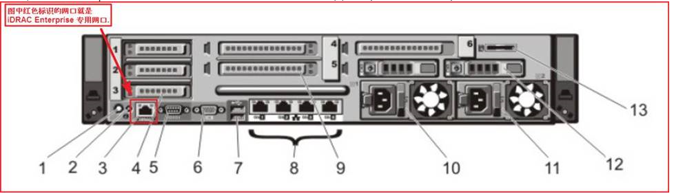
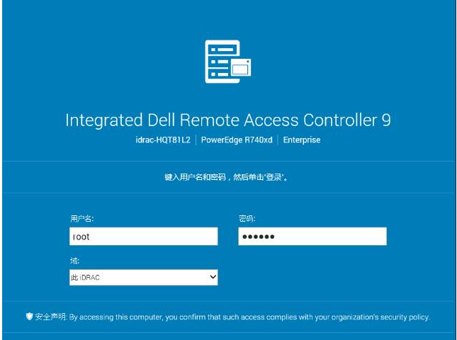

## iDRAC远程控制卡

iDRAC卡相当于是附加在服务器上的一台小电脑，通过与服务器主板上的管理芯片BMC进行通信，监控与管理服务器的硬件状态信息。它拥有自己的系统和IP地址，与服务器上的OS无关

iDRAC分为 Express和Enterprise 两种版本，iDRAC Express 默认是用服务器1号网口来连接， iDRAC[查看更多内容](https://www.dell.com/support/kbdoc/zh-cn/000181641/14g服务器idrac远程控制卡的使用方法#)

### 应用

**使用场景：**

1、远程安装操作系统

登录远程管理卡管理界面，用控制卡上的虚拟介质映射功能把自己电脑上的ISO文件或者物理光驱投递给机房里服务器。

2、电源控制功能

远程登录管理界面，进行开机、关机、重启

3．检查服务器硬件状态

监控电池、风扇、CPU、内存、磁盘等硬件设备的状态

登陆界面

参考:[14G服务器iDRAC远程控制卡的使用方法 | Dell 中国](https://www.dell.com/support/kbdoc/zh-cn/000181641/14g服务器idrac远程控制卡的使用方法)

[远程管理卡介绍&使用场景 - 程序员大本营 (pianshen.com)](https://www.pianshen.com/article/53821572121/)

