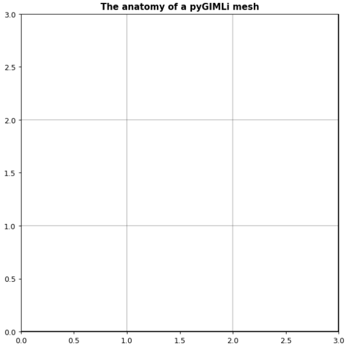

结构mesh类的结构

```python
m = pg.createGrid(4,4)
```



### 1. cell子类

m.cells()

包括方法：allNodes()

/marker

```python
for cell in m.cells():
    node = cell.allNodes()[2]
#     type(node)
    print(node.id(),node.x(),node.y())
```


### 2. node子类

m.nodes()

```python
for node in m.nodes():
    print(node.id(),node.x(),node.y())
```

