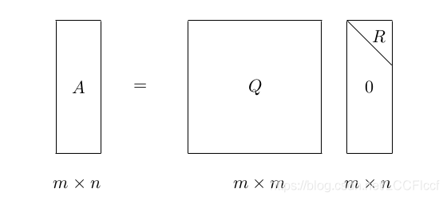
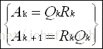
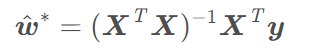
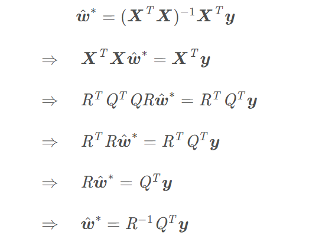
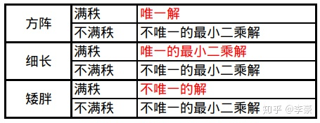

### QR分解

将原矩阵分解成一个正交矩阵Q和一个上三角矩阵R的乘积。（正交阵是指满足$AA^T=E$或者$A^T A=E$的n阶方阵A，其中E为n阶单位阵）

#### 算法

求解QR分解主要有三种方法

- Gram-Schmidt正交化法
- Household变换法
- Givens变换法

#### 应用

- 求矩阵特征值：QR算法求矩阵全部特征值的基本思想是利用矩阵的QR分解通过迭代格式。参考：[QR分解求矩阵全部特征值_xxc1605629895的博客-CSDN博客_qr分解法 求特征值](https://blog.csdn.net/johnf_nash/article/details/13292803)

- 求解最小二乘法

即求解

令$X=QR$

#### 要求

一般矩阵即可

### SVD

特征值分解（EVD）类似，但只能用在方阵上。
$$
A=Q\sum Q^{-1}
$$
奇异值分解
$$
A=U\sum V^T
$$
U和V都是正交阵。$\sum$是对角阵。

对于一般的矩阵A，我们可以构造对角阵$AA^T$或$A^TA$，再进行特征值分解。

之所以做奇异值分解或者特征分解，是因为一般来讲，矩阵的特征值或者奇异值大小相差很多，最大的几个特征值或者奇异值之和就能占据所有特征值或者奇异值之和的99%了，这样用最大的几个就可以近似原矩阵了，实现了压缩和近似。

#### 应用

- PCA压缩
- 伪逆

$$
A^{-1}=V\sum^{-1}U^T
$$

- 进而求解线性方程组，适用于最小二乘问题

$$
A=U\sum V^T \rightarrow x=V\sum^{-1}U^T b
$$

- 
- 