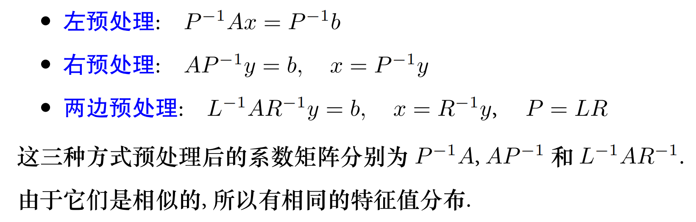

## 预处理

对于方程组
$$
Ax=b,\quad A\in \mathbb{R}^{n\times n},\, b\in \mathbb{R}^n
$$
A是非奇异的方阵

如果在方程两边同乘以一个非奇异矩阵$P\in\mathbb{R}^{n\times n}$的逆，则得到：
$$
P^{-1}Ax=P^{-1}x
$$
P就是预处理子（preconditioner）。

### P的性质

- $P^{-1}A$有更好的特征值分布或更小的条件数
- $Pz=r$更容易求解

### 左右预处理

三种方式的特点：

1. 左处理最自然，不需要额外去计算x
2. 右预处理不影响残差，原来的残差$r=b-Ax$，预处理后残差$r=b-AP^{-1}y$
3. 中心预处理可以保留系统的对称性，当A对称时，可以选择对称矩阵$P=LL^T$

### 方式选择

若 A 对称正定, 用 CG 求解, 这三种方式的预处理效果基本一致. 但若 A 非对称 (特别是非正规) 情形, 效果可能会相差很大. 实际使用中, 选取哪种预处理方式, 根据问题本身和所用的算法来确定. 对于 GMRES, 右预处理比较合适, 因为预处理后的残量就是真实残量

### 预处理子的构造

有两大类：

- 代数预处理子，仅根据矩阵来构造
- 专用预处理子，根据问题的物理背景构造预处理子；如多重网格, 区域分解, 快速变换等等

### 常用代数预处理子方法

- 设有矩阵分裂 A = M − N, 则 M 可作为一个预处理子; 
- 不完全 LU 分解; 
- 近似逆, 即选取矩阵 P, 使得$ P^{−1} ≈ A^{−1}$ ;
- 对角矩阵, 块对角矩阵, 三角矩阵, 块三角矩阵等等.

1. 对角预处理子 (Jocobi 预处理子)：$P=diag(A)$。实质就是对方程组中每一个方程都乘上一个系数，这里这个系数选择对角线元素的倒数；这对于**对角占优矩阵**有用；对角占优矩阵是指一行中对角线条目的大小大于或等于该行中所有其他（非对角线）条目的大小之和。更确切地说，矩阵 *一种* 如果对角线占主导地位。
2. 三对角预处理子：$P=tridiag(A)$
3. Gauss-Seidel 预处理子， $P=D+L$，其中$D=diag(A)$，L为矩阵A的严格下三角部分
4. SOR预处理子，$P=\frac{1}{\omega}(D+\omega L)$，ω为松弛参数
5. 不完全LU分解，$A\approx LU$，L和U分别为下三角和上三角矩阵，且保持稀疏性（LU分解后没有稀疏性）
6. 不完全 Cholesky (ichol) 分解预处理子 (要求系数矩阵 A 对称)

迭代方法的收敛速度与线性系统的谱条件数是紧密相关的

[slides_ch08_preconditioning.pdf (ecnu.edu.cn)](https://math.ecnu.edu.cn/~jypan/Teaching/MatrixComp/slides_ch08_preconditioning.pdf)

[线性系统的迭代求解: 为什么需要预处理? - 数值分析大巴 (numanal.com)](https://numanal.com/why-preconditioning/)

[Preconditioning Techniques for Large Linear Systems: A Survey (emory.edu)](http://www.mathcs.emory.edu/~benzi/Web_papers/survey.pdf)