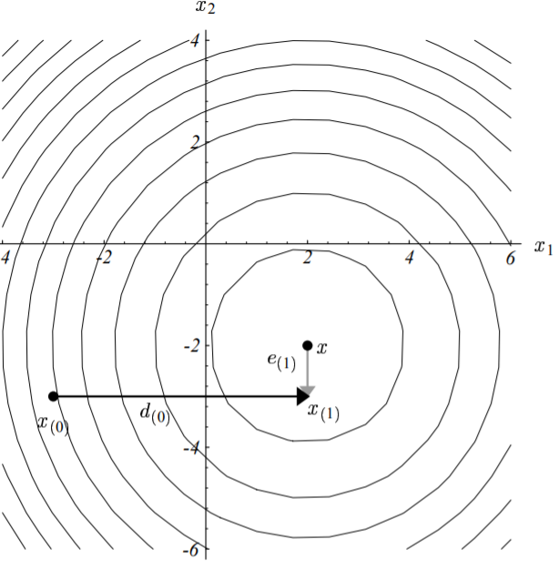
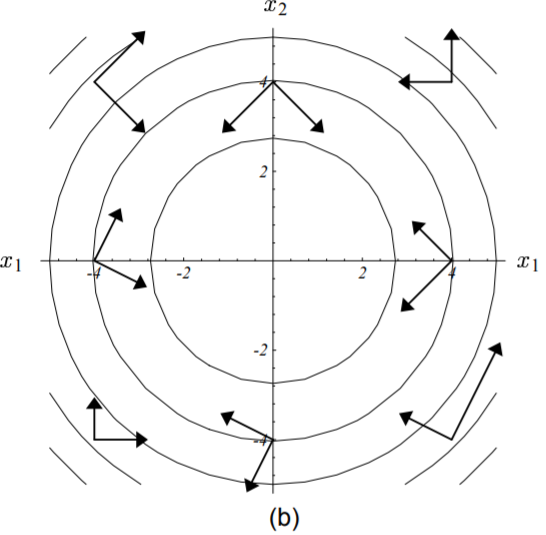

### 共轭方向法

#### 共轭性

最速下降法在收敛中其早期的迭代步骤往往在沿着同一个方向（如上图，第一步和第三步方向相同）。

如果我们每次迭代前，都能选择正确的方向迈出去，效果不是会更好吗？

方法：选择一系列相互正交的搜索方向，$\vec{d_{(0)}}, \vec{d_{(1)}}, \cdots, \vec{d_{(n-1)}}$，每个搜索方向只移动一步，而这异步的长度刚好对齐到最小值点$\vec{x}$其实就是刚好能够消除误差向量在这个方向上的分量），$n$步之后，迭代结束，到达最小值点。

注意：第一轮迭代后的误差向量$\vec{e_1}$与第一步搜索方向$\vec{d_0}$正交（如上图）。
$$
\vec{x_{(i+1)}} = \vec{x_{(i)}} + \alpha_{(i)} \cdot \vec{d_{(i)}} 
\tag{7 - 1}
$$
为了确定$\alpha$的值，需要用误差向量$\vec{e_{(i+1)}}$与搜索方向$\vec{d_{(i)}}$正交这一关系，同时避免后面继续搜索方向$\vec{d_{(i)}}$。这样得到
$$
\begin{split} \vec{d_{(i)}}^T \vec{e_{(i+1)}} &= 0 \\ \vec{d_{(i)}}^T ( \vec{e_{(i)}} + \alpha_{(i)} \vec{d_{(i)}}) &= 0 \qquad (据式7-1)\\ \alpha_{(i)} &= -\frac{\vec{d_{(i)}}^T \vec{e_{(i)}}}  {\vec{d_{(i)}}^T \vec{d_{(i)}}} \end{split} \tag{7 - 2}
$$
但是由于误差向量$\vec{e_{(i)}}$未知，还无法求出$\alpha$。

解决方法是用**矩阵·向量正交(A-orthogonal)**替代**向量正交(orthogonal)**。所谓的矩阵·向量正交（或共轭），是指存在两个向量$\vec{d_{(i)}}、\vec{d_{(j)}}$，满足：
$$
\vec{d_{(i)}}^T \textbf{A} \vec{d_{(j)}} = 0 , \quad i \ne j \tag{7 - 3}
$$
图形解释：

变换前不正交：

经过（A）变换后正交了：

由此我们的前提条件就不再是要求搜索方向两两正交，而是变成了本轮迭代后的误差向量和上轮的搜索方向向量两两矩阵正交即$\vec{d_{(i)}} \textbf{A} \vec{e_{(i+1)}} = 0$。

**这种矩阵正交性条件刚好与最速下降法中沿着搜索方向找寻最小值点等价**。

证明如下：
$$
\begin{split} \frac{d}{d_\alpha} f(\vec{x_{(i+1)}}) &= f’(\vec{x_{(i+1)}})^T \frac{d}{d_\alpha} \vec{x_{(i+1)}} &\qquad (据式4-3)\\ &= -\vec{r_{(i+1)}}^T \vec{d_{(i)}} \\ &= -(\vec{d_{(i)}}^T \vec{r_{(i+1)}})^T \\ &= （\vec{d_{(i)}}^T \textbf{A} \vec{e_{(i+1)}})^T = 0 &\qquad (据式6-4) \\ \therefore \quad \vec{d_{(i)}}^T \textbf{A} \vec{e_{(i+1)}} &= 0 \end{split}  \tag{7 - 4}
$$
由此得到：
$$
\begin{split} \alpha_{(i)} &= -\frac{\vec{d_{(i)}}^T \textbf{A} \vec{e_{(i)}}} {\vec{d_{(i)}}^T \textbf{A} \vec{d_{(i)}}} \\ &= \frac{\vec{d_{(i)}}^T \vec{r_{(i)}}} {\vec{d_{(i)}}^T \textbf{A} \vec{d_{(i)}}} \end{split} \tag{7 - 5}
$$

#### 格莱姆-施密特共轭

由上节可知，要求的目标值，我们现在唯一需要的就是一组**矩阵·向量**正交的搜索方向向量${ \vec{d_{(i)}} }$的集合。幸运的是，存在一种非常简单的方法计算这些向量，这种方法我们称之为**[共轭格莱姆-施密特过程](https://en.wikipedia.org/wiki/Gram–Schmidt_process)**。

### 共轭梯度法

参考：[共轭梯度法通俗讲义 | 断鸿声里，立尽斜阳 (flat2010.github.io)](https://flat2010.github.io/2018/10/26/共轭梯度法通俗讲义/#译者后记)