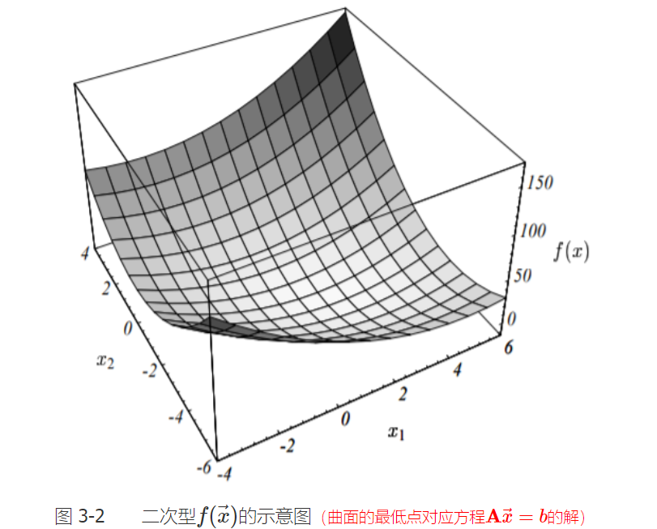
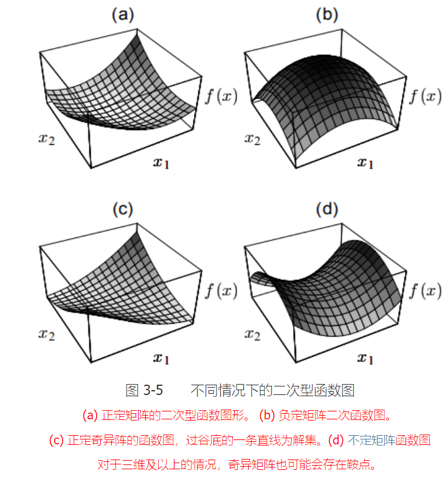
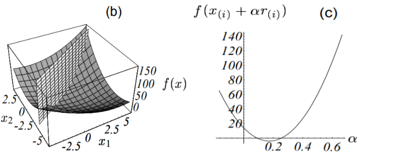
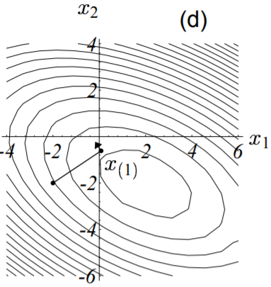

### 收敛系数关于条件数的函数图稀疏矩阵

- 若A式稠密矩阵，最好的求解方法式先对A矩阵分解，在用置换法回代求解

- 稀疏矩阵矩阵分解得到的三角镇非零元素通常比其原始矩阵多，所以受限于内存大小无法进行，耗时较久，因此适用于迭代解法

#### 矩阵性质

$$
(AB)^T=B^TA^T\\
(AB)^{-1}=B^{-1}A^{-1}
$$

### 二次型

二次型是指关于向量的二次数值型函数，形如：
$$
f(\vec{x}) = \frac{1}{2}\vec{x}^T A \vec{x} - b^T \vec{x} +c
$$
$A$是正定的，所以其二次型图像为一个抛物型的碗；

因为A为对称，则$A^T=A$，所以
$$
f'(\vec{x})=\frac{1}{2}A^T \vec{x}+\frac{1}{2}A \vec{x}-b\\
f'(\vec{x})=A^T\vec{x}-b=A\vec{x}-b
$$
这样求二次型的最小值即为Ax-b=0的解

注意：

- 即使$A$是非对称阵，由于$\frac{1}{2}(A^T+A)$为对称阵，所以还是可以用CG求解。
- 若A不是正定，那么全局最小值可能不止一个（即不再与Ax-b等价？）
  - 若为负定，则图形为翻转的碗，
  - 若$A$为奇异矩阵（解不唯一），则解集为一条直线或超平面。
  - 不属于上面任何一种情况，则为鞍点

### 最速下降法

最速下降法：每前进一步，选择的方向必然使得函数$f(\vec{x})$减少最多的方向，即梯度$f'(\vec{x})$的反方向，即$-f'(\vec{x})=-(A\vec{x}-b)$

#### 方向

定义：

- 误差向量：$\vec{e}_{(i)}=\vec{x}_{(i)}-\vec{x}$，第$i$步距离最小值点$(x)$的距离
- 残差向量：$\vec{r}_{(i)}=b-A\vec{x}_{(i)}$，第$i$步距离真实值$b$的距离。

所以：
$$
\vec{r}_{(i)}=-A\vec{e}_{(i)}\\
\vec{r}_{(i)}=-f'(\vec{x}_{(i)})
$$

#### 步长

$$
\vec{x}_{(1)} = \vec{x}_{x(0)} + \alpha \vec{r}_{(0)}
$$

$\alpha$应该取什么值才能使得迈出的下一步的函数值在所有可能的步长中最小呢？（看二次型图像，若$f(x)$不是最小，则跑得太远）。

一般使用线性搜索。将沿着指定的直线，寻找到使得函数值$f(\vec{x}_{(i)}+\alpha \vec{r}_{(i)})$最小的$\alpha$。过程如下：

1. 先过这条直线作与抛物面垂直的一个平面（图(b)）
2. 绘制出该平面与抛物面相交的抛物线（图(c)）;
3. 抛物线底部点即对应于函数值最小值点，可据此求出对应的步长即为αα的值。

结论：**当且仅当**方向导数$\frac{d}{dx}f(\vec{x}_{(1)})=0$时，$\alpha$最佳。
$$
\begin{split} \frac{d}{d_\alpha} f(\vec{x_{(1)}}) &= f’(\vec{x_{(1)}})^T \frac{d}{d_\alpha} \vec{x_{(1)}} \\ &= f’(\vec{x_{(1)}})^T \cdot \vec{r_{(0)}} \\ &= -\vec{r_{(1)}}^T \cdot \vec{r_{(0)}} \end{split} \label{directional_derivative_of_quadratic_function} \tag{4 - 3}
$$
上式为0时，即两次残差向量相互正交时，函数值最小。

具体求解方法：
$$
\begin{split} \vec{r_{(1)}}^T \cdot \vec{r_{(0)}} &= (\vec{b} - \textbf{A} \vec{x_{(1)}})^T \cdot \vec{r_{(0)}} \\ &= [\vec{b} - \textbf{A} (\vec{x_{(0)}} + \alpha \vec{r_{(0)}})]^T \cdot \vec{r_{(0)}} \\ &= (\vec{b} - \textbf{A} \vec{x_{(0)}} + \alpha \textbf{A} \vec{r_{(0)}})^T \cdot \vec{r_{(0)}} \\ &= (\vec{b} - \textbf{A} \vec{x_{(0)}})^T \cdot \vec{r_{(0)}} - \alpha (\textbf{A} \vec{r_{(0)}})^T \cdot \vec{r_{(0)}} \\ &= \vec{r_{(0)}}^T \cdot \vec{r_{(0)}} - \alpha \cdot \vec{r_{(0)}}^T \textbf{A} \cdot \vec{r_{(0)}} \end{split} \tag{4 - 4}
$$
上式为0，则
$$
\alpha = \frac{\vec{r_{(0)}}^T \cdot \vec{r_{(0)}}}   {\vec{r_{(0)}}^T \textbf{A} \cdot \vec{r_{(0)}}}
$$

#### 总结

- 方向：$\vec{r_{(i)}} = \vec{b} - \textbf{A} \vec{x_{(i)}}$
- 步长：$\alpha_{(i)} = \frac{\vec{r_{(i)}}^T \cdot \vec{r_{(i)}}}   {\vec{r_{(i)}}^T \textbf{A} \cdot \vec{r_{(i)}}}$

$$
\vec{x_{(i + 1)}} = \vec{x_{(i)}} + \alpha_{(i)} \vec{r_{(i)}}  \tag{4 - 5}
$$

#### 简化

据方向和步长的计算公式可以看出，每轮迭代都需要进行两次矩阵-向量乘法计算，因此整个算法的计算效率就由这两次矩阵-向量乘法运算决定。幸运的是，通过变换我们可以消除其中的一个。

将式（4-5）等式两边同时左乘一个矩阵$−A$，再同时加$b$，于是有
$$
\vec{r_{(i + 1)}} = \vec{r_{(i)}} - \alpha_{(i)} \textbf{A} \vec{r_{(i)}} \tag{4 - 6}
$$

### 收敛性分析

将对称正定阵的条件数定义为最大特征与最小特征之比：
$$
\kappa = \frac{\lambda_{max}} {\lambda_{min}} 
$$
则最速下降法的收敛结果表示为：
$$
||\vec{e_{(i)}}||_\textbf{A} \le (\frac{\kappa - 1}{\kappa + 1})^i ||\vec{e_{0}}||_\textbf{A} 
$$

收敛系数关于条件数的函数图

参考：[共轭梯度法通俗讲义 | 断鸿声里，立尽斜阳 (flat2010.github.io)](https://flat2010.github.io/2018/10/26/共轭梯度法通俗讲义/#译者后记)