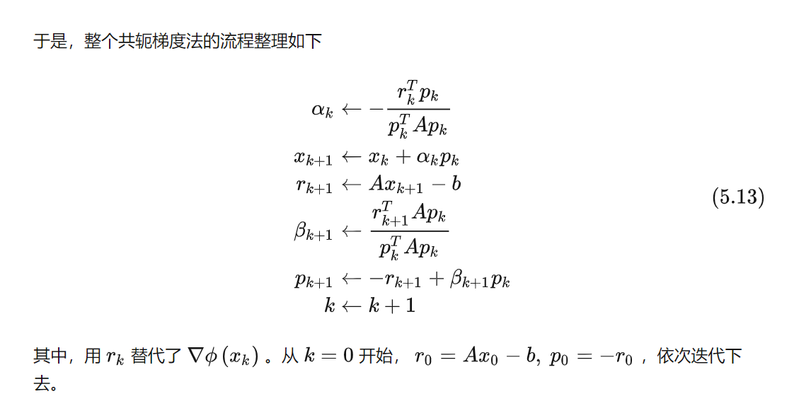
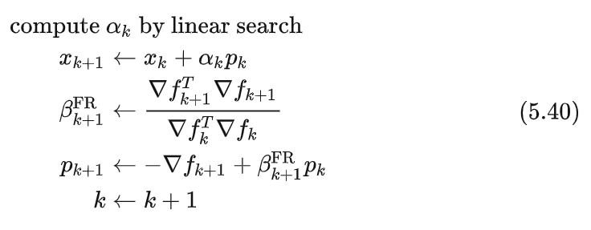
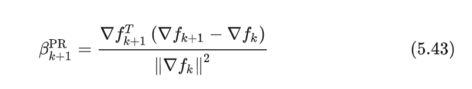

### FR-CG

原CG：

对共轭梯度的改进

1. 修改计算$\alpha_k$的方式，用[线搜索（一）：步长的选取](https://zhuanlan.zhihu.com/p/90758617)中介绍的线搜索算法来搜索 pk 方向上可接受的步长。之所以这样做，是因为在非线性问题中，我们已经无从构造一组共轭向量了，而且也不可能保证N次迭代内收敛
2. 用$\nabla f_k$代替$r_k$。因为在CG中，残差恰好就是梯度，这里只不过将其推广而已。换句话说，式(5.40)不过是CG推广到普通非线性函数后的结果，CG则是其在二次函数下的特例。

### PR-CG

PR-CG是FR-CG的一种改进，由Polak和Ribière提出，与FR-CG的唯一区别在于如何选取 βk 。选取方法为

