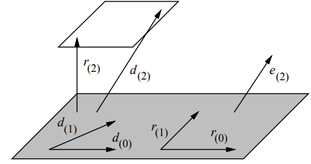
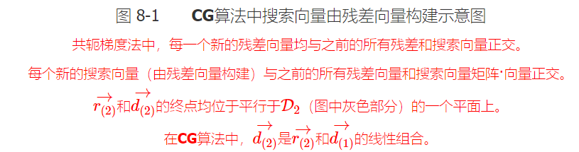
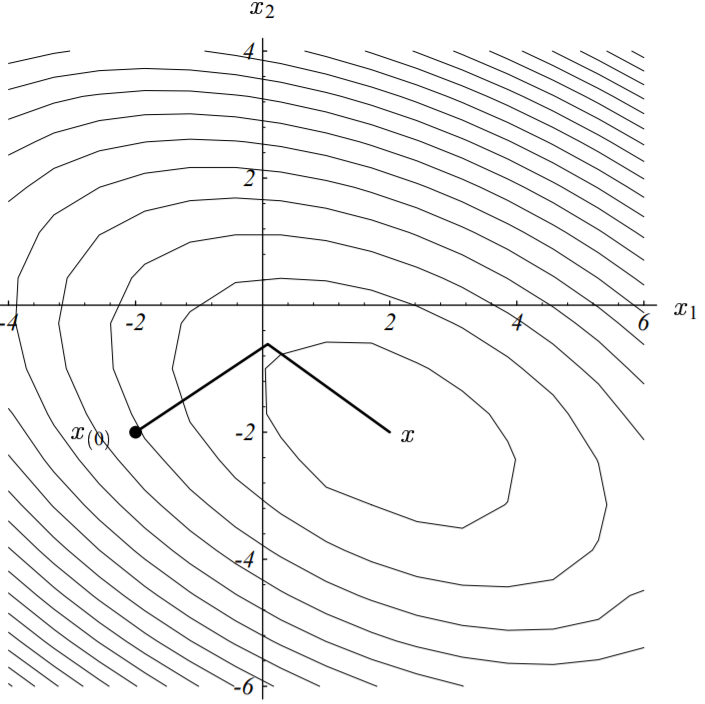

### 共轭梯度法

**CG**算法就是搜索方向由残差的共轭（即令$\vec{u_i} = \vec{r_{(i)}}$）组成的共轭方向法。

我们首先来考虑选择残差的共轭构建搜索方向的具体实现。由于搜索向量由残差向量构建，因此张成子空间$\mathcal{D}_i$即为$\lbrace \vec{r_{(0)}}, \vec{r_{(1)}}, \cdots, \vec{r_{(i-1)}} \rbrace$。

这个优点也让**CG**算法在每轮迭代中的空间和时间复杂度均从$\mathcal{O}(n^2)$变到$\mathcal{O}(m)$，其中$m$是矩阵$A$中的非零项数量。由于每一个残差向量都与它之前迭代过程中的搜索方向向量正交，因此它也必然与之前的残差向量正交，如下图所示

此时：
$$
\vec{r_{(i)}}^T \vec{r_{(j)}} = 0, \qquad i \neq j  \tag{8 - 1}
$$
中间过程不太懂，略过……

#### 算法公式

$$
\begin{split} \vec{d_{(0)}} &= \vec{r_{(0)}} = \vec{b_{(0)}} - \textbf{A} \vec{x_{(0)}} \\ \alpha_{(i)} &= \frac{\vec{r_{(i)}}^T \vec{r_{(i)}}} {\vec{d_{(i)}}^T \textbf{A} \vec{d_{(i)}}} \qquad (据式) \\ \vec{x_{(i+1)}} &= \vec{x_{(i)}} + \alpha_{(i)} \vec{d_{(i)}} \\ \vec{r_{(i+1)}} &= \vec{r_{(i)}} - \alpha_{(i)} \textbf{A} \vec{d_{(i)}} \\ \beta_{(i+1)} &= \frac{\vec{r_{(i+1)}}^T \vec{r_{(i+1)}}} {\vec{r_{(i)}}^T \vec{r_{(i)}}} \\ \vec{d_{(i+1)}} &= \vec{r_{(i+1)}} + \beta_{(i+1)} \vec{d_{(i)}} \end{split} \tag{8 - 6}
$$

#### 对比

- 共轭梯度法比最速下降法更省内存（不需要存储前一次迭代的信息）

- 一般来说会在 n 步内终止，其中 n 是矩阵 A 的维数，但由于舍入误差的影响，迭代次数会比 n 多，因此常作为迭代法使用，但是也会在较快的有限步内终止！

[共轭梯度法通俗讲义 | 断鸿声里，立尽斜阳 (flat2010.github.io)](https://flat2010.github.io/2018/10/26/共轭梯度法通俗讲义/#译者后记)